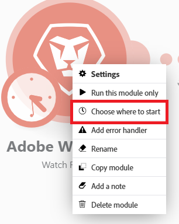

# Choose where a trigger module starts

Some trigger modules allow you to select the first bundle from which you want the retrieving of bundles to start.

You can also specify whether you want to retrieve all bundles or just the bundles from after a specific date.

For more information about trigger modules, see the section [Trigger modules](/help/workfront-fusion/get-started-with-fusion/understand-fusion/module-overview.md#trigger-modules) in the article Module overview.

## Access requirements

+++ Expand to view access requirements for the functionality in this article.

You must have the following access to use the functionality in this article:

<table style="table-layout:auto">
 <col> 
 <col> 
 <tbody> 
  <tr> 
   <td role="rowheader">[!DNL Adobe Workfront] package</td> 
   <td> 
Any
 </td> 
  </tr> 
  <tr data-mc-conditions=""> 
   <td role="rowheader">[!DNL Adobe Workfront] license</td> 
   <td> 
New: [!UICONTROL Standard]

Or

Current: [!UICONTROL Work] or higher
 </td> 
  </tr> 
  <tr> 
   <td role="rowheader">[!DNL Adobe Workfront Fusion] license**</td> 
   <td>
   
Current: No [!DNL Workfront Fusion] license requirement.

   
Or

   
Legacy: Any 

   </td> 
  </tr> 
  <tr> 
   <td role="rowheader">Product</td> 
   <td>
   
New:
 <ul><li>[!UICONTROL Select] or [!UICONTROL Prime] [!DNL Workfront] plan: Your organization must purchase [!DNL Adobe Workfront Fusion].</li><li>[!UICONTROL Ultimate] [!DNL Workfront] plan: [!DNL Workfront Fusion] is included.</li></ul>
   
Or

   
Current: Your organization must purchase [!DNL Adobe Workfront Fusion].

   </td> 
  </tr>
 </tbody> 
</table>

For more detail about the information in this table, see [Access requirements in documentation](/help/workfront-fusion/references/licenses-and-roles/access-level-requirements-in-documentation.md).

For information on [!DNL Adobe Workfront Fusion] licenses, see [[!DNL Adobe Workfront Fusion] licenses](/help/workfront-fusion/set-up-and-manage-workfront-fusion/licensing-operations-overview/license-automation-vs-integration.md).

+++

## Choose where a trigger module starts

1. Click the **[!UICONTROL Scenarios]** tab in the left panel.
1. Select the scenario where you want to choose where the trigger starts.
1. Click anywhere on the scenario to enter the Scenario editor.
1. Configure and save a trigger module.

   Or

   Right-click the icon for the trigger module, and select **Choose where to start**.

   

1. Select an option in the **[!UICONTROL Choose where to start]** box that appears.

   The options displayed depend on the possibilities of a given service. They may include the following:

   <table style="table-layout:auto">
        <tr>
            <td>[!UICONTROL From now on] (default)</td>
            <td>Retrieves all bundles added or updated (depending on settings) after this option is selected</td>
        </tr>
        <tr>
            <td>[!UICONTROL Since specific date]</td>
            <td>Retrieves all bundles added or updated (depending on settings) after a specified date and time</td>
        </tr>
        <tr>
            <td>[!UICONTROL All]</td>
            <td>Retrieves all available bundles</td>
        </tr>
        <tr>
            <td>[!UICONTROL Choose manually]</td>
            <td>Allows you to select the first bundle from which the retrieval of bundles is to start</td>
        </tr>
   </table>
