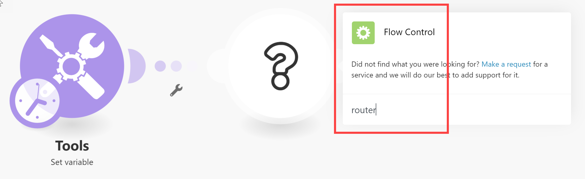
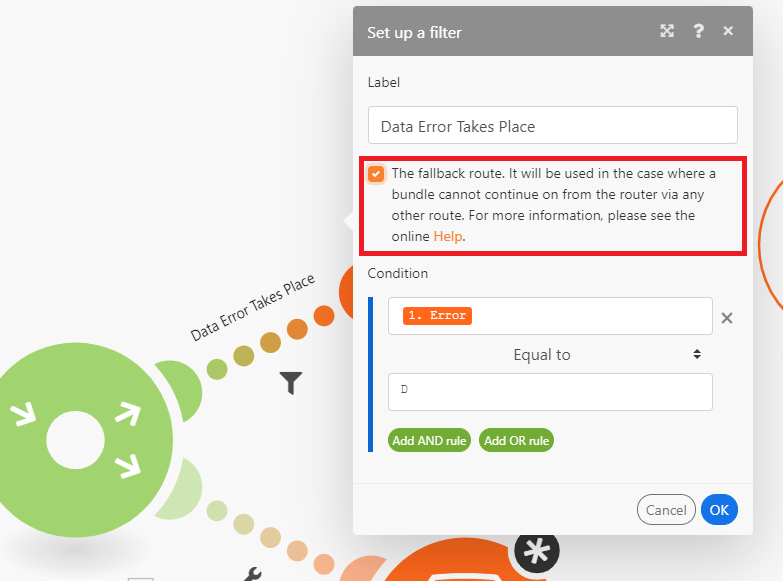

# Add a Router module and configure routes

<!--EDIT ME and separate out the reference stuff-->

<!-- Ask Courtney if this needs to be split up-->

<!--IN PROGRESS-->

The Router module allows you to branch your scenario into several routes, and process the data within each route differently. When a Router module receives a bundle, it forwards it to each connected route in the order the routes were attached to the Router module.

Routes are processed sequentially, not in parallel. A bundle is not sent to the next route until it has been completely processed by the previous route.

## Access requirements

+++ Expand to view access requirements for the functionality in this article.

You must have the following access to use the functionality in this article:

<table style="table-layout:auto">
 <col> 
 <col> 
 <tbody> 
  <tr> 
   <td role="rowheader">[!DNL Adobe Workfront] plan</td> 
   <td> 
Any
 </td> 
  </tr> 
  <tr data-mc-conditions=""> 
   <td role="rowheader">[!DNL Adobe Workfront] license</td> 
   <td> 
New: [!UICONTROL Standard]

Or

Current: [!UICONTROL Work] or higher
 </td> 
  </tr> 
  <tr> 
   <td role="rowheader">[!DNL Adobe Workfront Fusion] license**</td> 
   <td>
   
Current: No [!DNL Workfront Fusion] license requirement.

   
Or

   
Legacy: Any 

   </td> 
  </tr> 
  <tr> 
   <td role="rowheader">Product</td> 
   <td>
   
New:
 <ul><li>[!UICONTROL Select] or [!UICONTROL Prime] [!DNL Workfront] Plan: Your organization must purchase [!DNL Adobe Workfront Fusion].</li><li>[!UICONTROL Ultimate] [!DNL Workfront] Plan: [!DNL Workfront Fusion] is included.</li></ul>
   
Or

   
Current: Your organization must purchase [!DNL Adobe Workfront Fusion].

   </td> 
  </tr>
 </tbody> 
</table>

<!--For more detail about the information in this table, see [Access requirements in Workfront documentation](/help/quicksilver/administration-and-setup/add-users/access-levels-and-object-permissions/access-level-requirements-in-documentation.md).-->

For information on [!DNL Adobe Workfront Fusion] licenses, see [[!DNL Adobe Workfront Fusion] licenses](/help/workfront-fusion/set-up-and-manage-workfront-fusion/licensing-operations-overview/license-automation-vs-integration.md).

+++

## Add a Router module to a scenario

You must add a Router module before configuring routes.

1. To connect the Router module after a module, click on the module's right handle, start typing **Router** to search for it, then select **[!UICONTROL Flow Control]** > **Router** in the list of modules that displays.

   

    Or
 
   To insert the Router module between two modules, click on the wrench icon below the route connecting the two modules and select **[!UICONTROL Add a router]** from the menu.

   
1. Add the first route to the router by clicking on the right handle of the router and adding a module, similar to adding any module. 
1. To add another route, click the router module. A route appears. Add modules to this route as desired.

   You can add as many routes as you want.

1. To verify the order of the routes, click the Auto-align icon .

   The routes are arranged in the order they execute. The top route executes first.

1. (Optional) To change route order, unlink the routes by right clicking on the path from the router and selecting Unlink, then dragging them to the router module in the desired order. The first route attached will be the first route to execute (the top route).

1. Continue to [Add a filter to a route](#add-a-filter-to-a-route).

## Add a filter to a route

You can put a filter on a route after the Router module to filter bundles. Only bundles that pass through the filter will be handled by the modules on the route.

If data passes the filter of more than one route, the data is handled by both routes. The top route handles the data first.

1. Click the wrench icon  on the path where you want to set a filter. This is the path between the router module and the first module of the route.
1. Select **Set up a filter.**
1. In the label field of the panel that displays, add a label. This label displays in the scenario. 
1. Configure filter conditions.

   <!--For more information, see [Add a filter to a scenario in [!DNL Adobe Workfront Fusion]](../../workfront-fusion/scenarios/add-a-filter-to-a-scenario.md).-->

1. Click **[!UICONTROL OK]** to save the filter setup.

1. Continue to [Configure a fallback route](#configure-a-fallback-route).

## Configure a fallback route

The fallback route is the route that executes on any bundles that do not pass any filter to another route.

You can enable a fallback route in the filter panel.

1. Click the wrench icon  on the path where you want to set a filter. This is the path between the router module and the first module of the route.
1. Select **Set up a filter.**
1. In the label field of the panel that displays, add a label. This label displays in the scenario.
1. Enable the fallback route checkbox.

   

1. Click **[!UICONTROL OK]** to save the filter setup.

The Fallback route is marked with a different arrow in the Router module:

## Example: `if/else` use case

>[!BEGINSHADEBOX]

A typical use case of the fallback route is to continue the flow with one route if the condition is met and with another route if it is not. as in the following steps:

In this example, the first route is configured with a filter. This represents the `if` component. 

   

The second route is configured as a fallback route. This represents the `else` component.

   

>[!ENDSHADEBOX]
