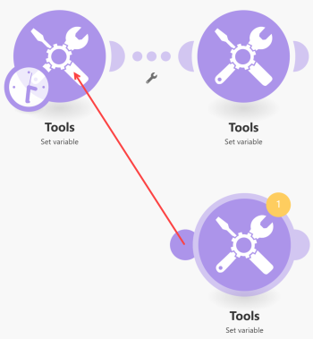

# Add a Router module and configure routes

<!--EDIT ME and separate out the reference stuff-->

<!-- Ask Courtney if this needs to be split up-->

<!--IN PROGRESS-->

The Router module allows you to branch your scenario into several routes, and process the data within each route differently. When a Router module receives a bundle, it forwards it to each connected route in the order the routes were attached to the Router module.

Routes are processed sequentially, not in parallel. A bundle is not sent to the next route until it has been completely processed by the previous route.

## Access requirements

+++ Expand to view access requirements for the functionality in this article.

You must have the following access to use the functionality in this article:

<table style="table-layout:auto">
 <col> 
 <col> 
 <tbody> 
  <tr> 
   <td role="rowheader">[!DNL Adobe Workfront] plan</td> 
   <td> 
Any
 </td> 
  </tr> 
  <tr data-mc-conditions=""> 
   <td role="rowheader">[!DNL Adobe Workfront] license</td> 
   <td> 
New: [!UICONTROL Standard]

Or

Current: [!UICONTROL Work] or higher
 </td> 
  </tr> 
  <tr> 
   <td role="rowheader">[!DNL Adobe Workfront Fusion] license**</td> 
   <td>
   
Current: No [!DNL Workfront Fusion] license requirement.

   
Or

   
Legacy: Any 

   </td> 
  </tr> 
  <tr> 
   <td role="rowheader">Product</td> 
   <td>
   
New:
 <ul><li>[!UICONTROL Select] or [!UICONTROL Prime] [!DNL Workfront] Plan: Your organization must purchase [!DNL Adobe Workfront Fusion].</li><li>[!UICONTROL Ultimate] [!DNL Workfront] Plan: [!DNL Workfront Fusion] is included.</li></ul>
   
Or

   
Current: Your organization must purchase [!DNL Adobe Workfront Fusion].

   </td> 
  </tr>
 </tbody> 
</table>

<!--For more detail about the information in this table, see [Access requirements in Workfront documentation](/help/quicksilver/administration-and-setup/add-users/access-levels-and-object-permissions/access-level-requirements-in-documentation.md).-->

For information on [!DNL Adobe Workfront Fusion] licenses, see [[!DNL Adobe Workfront Fusion] licenses](/help/workfront-fusion/set-up-and-manage-workfront-fusion/licensing-operations-overview/license-automation-vs-integration.md).

+++

## Add a Router module to a scenario

You must add a Router module before configuring routes.

1. To connect the Router module after a module, click on the module's right handle, start typing **Router** to search for it, then select **[!UICONTROL Flow Control]** > **Router** in the list of modules that displays.

   

    Or
 
   To insert the Router module between two modules, click on the wrench icon below the route connecting the two modules and select **[!UICONTROL Add a router]** from the menu.

   

   >[!NOTE]
   >
   > You can also insert a Router module automatically. For example, in the image below, to connect the module in the lower-right corner to the one in the upper-left corner (which is already connected to the one in the upper-right corner), drag the left handle of the lower-right module and drop it onto the upper-left module.
   >
   >

1. Verify the order of the routes. you can click the [!UICONTROL Auto-align] icon, which will arrange the routes according to the order from top to bottom.
>
>   To change the order, remove the Router module and re-connect the routes in the desired order.
>
>* 
>

## Add a filter to a route

You can put a filter on a route after the Router module to filter bundles as on any other route:

1. Click one of the dots in the route.

   

1. In the **[!UICONTROL Set up a filter]** box that displays, add conditions, then click **[!UICONTROL OK]** to save the filter setup.

   

For more information, see [Add a filter to a scenario in [!DNL Adobe Workfront Fusion]](../../workfront-fusion/scenarios/add-a-filter-to-a-scenario.md).

## Configure a fallback route

The filter setup on a route after a Router module contains a special option: The fallback route:

When enabled, this route is used in the case when a bundle cannot continue on from the Router module via any other route because the filters on the other routes filtered it out.

The Fallback route is distinguished with a different arrow sign inside the Router module:

## If/Else

A typical use case of the fallback route is to continue the flow with one route if the condition is met and with another route if it is not, as in the following steps:

1. Insert a Router module in your scenario.
1. Connect both routes to the Router module .
1. Click on the first route and specify a condition:

   

1. Click on the second route and enable the [!UICONTROL fallback route] option:

   
