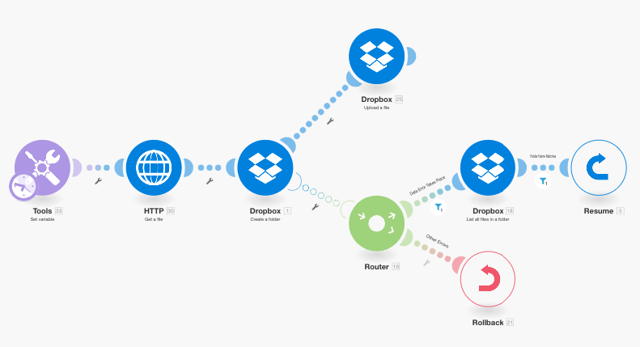

# Add filtering and nesting to error handling routes

You an add advanced error handling techniques to your error handling route by including filtering and nesting.

## Access requirements

+++ Expand to view access requirements for the functionality in this article.

You must have the following access to use the functionality in this article:

<table style="table-layout:auto">
 <col> 
 <col> 
 <tbody> 
  <tr> 
   <td role="rowheader">Adobe Workfront package 
   <td> 
Any
 </td> 
  </tr> 
  <tr data-mc-conditions=""> 
   <td role="rowheader">Adobe Workfront license</td> 
   <td> 
New: Standard

Or

Current: Work or higher
 </td> 
  </tr> 
  <tr> 
   <td role="rowheader">Adobe Workfront Fusion license**</td> 
   <td>
   
Current: No Workfront Fusion license requirement.

   
Or

   
Legacy: Any 

   </td> 
  </tr> 
  <tr> 
   <td role="rowheader">Product</td> 
   <td>
   
New:
 <ul><li>Select or Prime Workfront Plan: Your organization must purchase Adobe Workfront Fusion.</li><li>Ultimate Workfront Plan: Workfront Fusion is included.</li></ul>
   
Or

   
Current: Your organization must purchase Adobe Workfront Fusion.

   </td> 
  </tr>
 </tbody> 
</table>

For more detail about the information in this table, see [Access requirements in documentation](/help/workfront-fusion/set-up-and-manage-workfront-fusion/licensing-operations-overview/access-level-requirements-in-documentation.md).

For information on Adobe Workfront Fusion licenses, see [Adobe Workfront Fusion licenses](/help/workfront-fusion/set-up-and-manage-workfront-fusion/licensing-operations-overview/license-automation-vs-integration.md).

+++

## Filtering

There are two kinds of filtering that can take place on an error handler route.

* [Add a filter to the error handler route](#adding-a-filter-to-the-error-handler-route)
* [Add a Router followed by filters to the error handler route](#adding-a-router-followed-by-filters-to-the-error-handler)

### Add a filter to the error handler route 

You can use a filter to control which errors are handled by the error handler route. This allows you to process only specific types of errors. If an error does not pass through the filter, it will be treated as if there is no error handler route defined for the given module.

These filters are configured like any other filter in Fusion. For instructions, see [Add a filter to a scenario](/help/workfront-fusion/create-scenarios/add-modules/add-a-filter-to-a-scenario.md).

### Add a Router followed by filters to the error handler 

Adding a Router to an error handling route allows you to configure different routes for different types of errors.

For example, to configure one route to execute when the error is a DataError, you can set up a filter that allows the data to pass through if the mapped error type is equal to DataError.

For information on how Fusion evaluates and processes various data types, see [Error types](/help/workfront-fusion/references/errors/error-processing.md).

### Example: Error handling with filters

>[!BEGINSHADEBOX]

This example scenario shows how these filters work for error handling.

If you use the Dropbox > Create a folder module, and a folder with the same name already exists, the module throws a DataError:

The complete scenario functions as follows:

1. The Tools > Set Variable module contains the folder name
1. The HTTP > Get a file module fetches the file that needs to be uploaded to the folder
1. The Dropbox > Create a folder module throws an error if a folder already exists with the same name as the one mapped in the module
1. The error handler route (transparent bubbles) contains a router to filter the errors
   The first route is for a specified type of error called `DataError`.

   1. If a `DataError` takes place and the error details pass through the filter, the Dropbox >List all files/subfolders in a folder module lists all folders in Dropbox.
   1. The subsequent filter matches the folder names.
   1. The **Resume** directive specifies the folder ID and folder path of the existing folder, and the scenario execution resumes from the Dropbox > Create a folder module. However, instead of creating a new folder, Fusion uses the values from the Resume directive to move to the next module and upload the file in the existing folder.

1. The second route is for all other errors and ends with the Rollback directive, which results in stopping the scenario immediately

Below is a detailed explanation of the DataError route.

To use the existing folder in your subsequent modules, such as Upload a file, you must add an error handler route to the module and fetch the folder path to be mapped into the Resume directive module that follows:

The filter on the first route is set to only handle the particular error (DataError) that appears when a folder with the same name already exists:

The Dropbox > List all files in a folder module is configured to return all the folders in the target folder. The following filter only passes on the one we were originally trying to create. (The folder name is stored in the 33. Folder Name item.)

The Resume directive then supplies the Folder path as the output for the failed module. Note that the Folder ID has been left blank since it is not needed by the Upload a file module.

>[!ENDSHADEBOX]

## Nesting

Error handler routes can be created and configured on all modules, except routers. Therefore, you can  create an error handler route for a module that is already part of an existing error handler route.

>[!BEGINSHADEBOX]

Example:

A nested error handler route with filters:

In this scenario, the second error handler route is nested under the first error handler route. 

If the Dropbox > Create a folder module encounters an error, the execution moves to the first route. If the `DataError Takes Place` filter is passed, the next module executes, followed by the Resume directive module if an error does not occur in the Dropbox > List all files/subfolders in a folder module.

However, if an error does occur in the Dropbox > List all files/subfolders in a folder module, then the execution moves to Error Handler Route 2 and ends with the [!UICONTROL Ignore] directive. The [!UICONTROL Resume directive] module is not executed in this case.

>[!ENDSHADEBOX]
