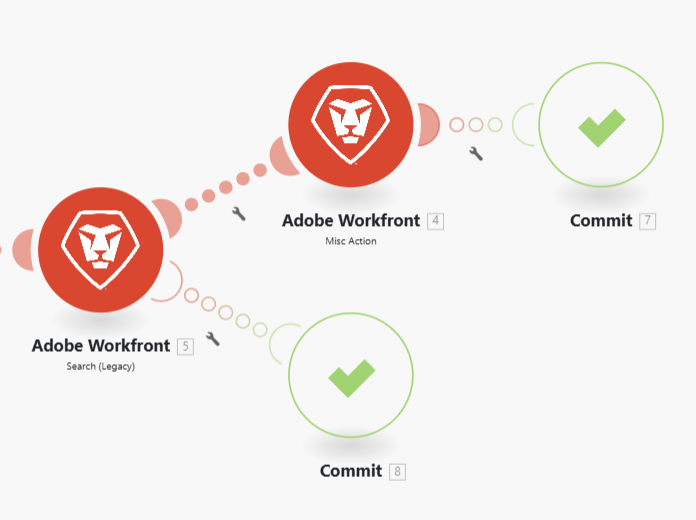

# Add error handling

Errors can occur during the execution of a scenario. 

For example, an error can occur because:

* A service is unavailable due to a failure
* A service responds with unexpected data
* Validation of input data fails
* Other reasons

If a module encounters an error during the scenario execution, and there is no error handling route attached to the module, the default error handling logic executes. 

By adding an error handler route to a module, you can replace the default error handling logic with your own. Adobe Workfront Fusion offers five different directives that can be inserted at the end of your error handler routes. 

For more information on default error handling, see [Error types](/help/workfront-fusion/references/errors/error-processing.md).

For more information on error handling directives, see [Directives for error handling](/help/workfront-fusion/references/errors/directives-for-error-handling.md).

## Access requirements

+++ Expand to view access requirements for the functionality in this article.

<table style="table-layout:auto">
 <col> 
 <col> 
 <tbody> 
  <tr> 
   <td role="rowheader">Adobe Workfront package</td> 
   <td> 
Any Adobe Workfront Workflow package and any Adobe Workfront Automation and Integration package

Workfront Ultimate

Workfront Prime and Select packages, with an additional purchase of Workfront Fusion.
 </td> 
  </tr> 
  <tr data-mc-conditions=""> 
   <td role="rowheader">Adobe Workfront licenses</td> 
   <td> 
Standard

Work or higher
 </td> 
  </tr> 
  <tr> 
   <td role="rowheader">Product</td> 
   <td>
   
If your organization has a Select or Prime Workfront package that does not include Workfront Automation and Integration, your organization must purchase Adobe Workfront Fusion.</li></ul>
   </td> 
  </tr>
 </tbody> 
</table>

For more detail about the information in this table, see [Access requirements in documentation](/help/workfront-fusion/references/licenses-and-roles/access-level-requirements-in-documentation.md).

+++

## Add an error handler

To add an error handler to a module:

1. Click the **[!UICONTROL Scenarios]** tab in the left panel.
1. Select the scenario where you want to add an error handling route.
1. Click anywhere on the scenario to enter the Scenario editor.
1. Right click the module after which you want to add an error handler route, and select **[!UICONTROL Add error handler]**:

    

    An error handler route is added to the module. If the module is the last module in a route, the error handler directlys follow the module. If the module has more modules after it, a separate error handler route is added. 

    The error handling module shows a list of Directives as well as the apps being used in your scenario. 

    
    
1. Select one of the directives. 

    Or 

    Add one or more modules to the error handler route. 

    If you add more modules to the route, the Ignore directive is applied by default. If there is an error, the subsequent modules on that route are processed.

    For more information on directives, see [Error handling directives](#error-handling-directives) in this article.

1. (Optional) Add a filter to the error handling route. For instructions, see [Add filtering and nesting to error handling routes](/help/workfront-fusion/create-scenarios/config-error-handling/advanced-error-handling.md).

>[!NOTE]
>
>Note that an error handler route is composed of transparent circles, while a regular route is composed of solid circles.

## Error handling directives

The directives are briefly explained below. For more information, see [Directives for error handling](/help/workfront-fusion/references/errors/directives-for-error-handling.md).

There are five directives, which can be grouped into the following categories based on whether a scenario execution continues after the error.

The following directives ensure that a scenario execution continues:

* **[!UICONTROL Resume]**: Allows you to specify a substitute output for the module with the error. The scenario execution status is marked as success.
* **[!UICONTROL Ignore]**: ignores the error. The scenario execution status is marked as success.
* **[!UICONTROL Break]**: Stores the input to the queue of incomplete executions. The scenario execution status is marked as warning. 

  For more information, see [View and resolve incomplete executions](/help/workfront-fusion/manage-scenarios/view-and-resolve-incomplete-executions.md).

If a scenario execution should stop when an error occurs, use one of the following directives:

* **[!UICONTROL Rollback]**: Stops the scenario execution immediately and marks its status as error.
* **[!UICONTROL Commit]**: Stops the scenario execution immediately and marks its status as success.

## Resources

For more information on error handling, see:

* [Directives for error handling in Adobe Workfront Fusion](/help/workfront-fusion/references/errors/directives-for-error-handling.md)
* [Add filtering and nesting to error handling routes](/help/workfront-fusion/create-scenarios/config-error-handling/advanced-error-handling.md)
