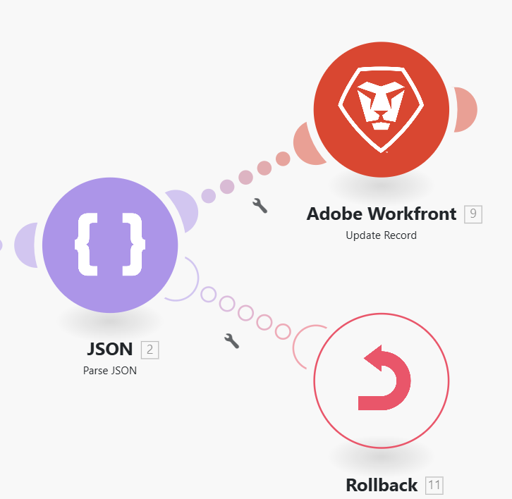

# Configure `throw` error workaround

In some cases, you may want to forcibly stop the scenario execution followed by  Rollback or Commit phase, or to stop the processing of a route and optionally store it in the queue of incomplete executions.

Currently, the error handling directives cannot be used out of the scope of an error handler route, and Adobe Workfront Fusion does not offer a module that would enable you to easily conditionally generate (throw) errors.

You can use the following workaround to mimic `throw` error functionality.

For information on incomplete executions, see [View and resolve incomplete executions in Adobe Workfront Fusion](/help/workfront-fusion/manage-scenarios/view-and-resolve-incomplete-executions.md).

For information on error handling directives, see [Directives for error handling in Adobe Workfront Fusion](/help/workfront-fusion/references/errors/directives-for-error-handling.md).

## Access requirements

+++ Expand to view access requirements for the functionality in this article.

<table style="table-layout:auto">
 <col> 
 <col> 
 <tbody> 
  <tr> 
   <td role="rowheader">Adobe Workfront package</td> 
   <td> 
Any Adobe Workfront Workflow package and any Adobe Workfront Automation and Integration package

Workfront Ultimate

Workfront Prime and Select packages, with an additional purchase of Workfront Fusion.
 </td> 
  </tr> 
  <tr data-mc-conditions=""> 
   <td role="rowheader">Adobe Workfront licenses</td> 
   <td> 
Standard

Work or higher
 </td> 
  </tr> 
  <tr> 
   <td role="rowheader">Product</td> 
   <td>
   
If your organization has a Select or Prime Workfront package that does not include Workfront Automation and Integration, your organization must purchase Adobe Workfront Fusion.</li></ul>
   </td> 
  </tr>
 </tbody> 
</table>

For more detail about the information in this table, see [Access requirements in documentation](/help/workfront-fusion/references/licenses-and-roles/access-level-requirements-in-documentation.md).

+++

## Workaround for `throw`

To conditionally throw an error, you can configure a module to make it purposely fail during its operation. One possibility is to employ the [!UICONTROL JSON] > [!UICONTROL Parse JSON] module, configured to optionally throw an error (`BundleValidationError` in this case):

You can then attach one of the error handling directives to the error handling route:

* **Rollback**: Force the scenario execution to stop and perform the rollback phase.
* **Commit**: Force the scenario execution to stop and perform the commit phase.
* **Ignore**: Stop the processing of a route.
* **Break**: Stop the processing of a route and store it in the queue of incomplete executions folder.

The following example shows the use of the [!DNL Rollback] directive:

