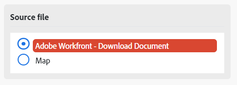

# Map a file between modules

Some modules can process files. These modules can either return an output file to be sent for further processing, or require a file to be passed to them for processing. Files can me mapped, so that a file output by one module can be processed by another.

## Access requirements

+++ Expand to view access requirements for the functionality in this article.

<table style="table-layout:auto">
 <col> 
 <col> 
 <tbody> 
  <tr> 
   <td role="rowheader">Adobe Workfront package</td> 
   <td> 
Any Adobe Workfront Workflow package and any Adobe Workfront Automation and Integration package

Workfront Ultimate

Workfront Prime and Select packages, with an additional purchase of Workfront Fusion.
 </td> 
  </tr> 
  <tr data-mc-conditions=""> 
   <td role="rowheader">Adobe Workfront licenses</td> 
   <td> 
Standard

Work or higher
 </td> 
  </tr> 
  <tr> 
   <td role="rowheader">Product</td> 
   <td>
   
If your organization has a Select or Prime Workfront package that does not include Workfront Automation and Integration, your organization must purchase Adobe Workfront Fusion.</li></ul>
   </td> 
  </tr>
 </tbody> 
</table>

For more detail about the information in this table, see [Access requirements in documentation](/help/workfront-fusion/references/licenses-and-roles/access-level-requirements-in-documentation.md).

+++

## Map files from source modules to target modules

Modules can process  files require two pieces of information:

* File name
* File content (data)

If any previous modules output a file, you can select the source module, and the name and data of the file output by that module are mapped to the target module.

You can also enter this name and data manually, or map it from previous modules. This may be convenient when, for exameple, renaming a file.

>[!NOTE]
>
>If you need to process a file from a URL, we recommend using the `HTTP > Get a File` module to download the file from the URL, and then mapping the file from the `HTTP > Get a File` module to the desired module's field in your scenario.
>
>

To map a file:

1. Click the **[!UICONTROL Scenarios]** tab in the left panel.
1. Select the scenario where you want to map a file.
1. Click anywhere on the scenario to enter the Scenario editor.
1. In the target module, which is the target you are mapping to, locate the **Source file** area.
1. To map a file output by a previous module, select the module that output the file.

   

1. To map the name and data manually, select Map, then enter or map the file's name and data.

   

1. Continue configuring the module, or click **OK**.
