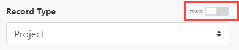
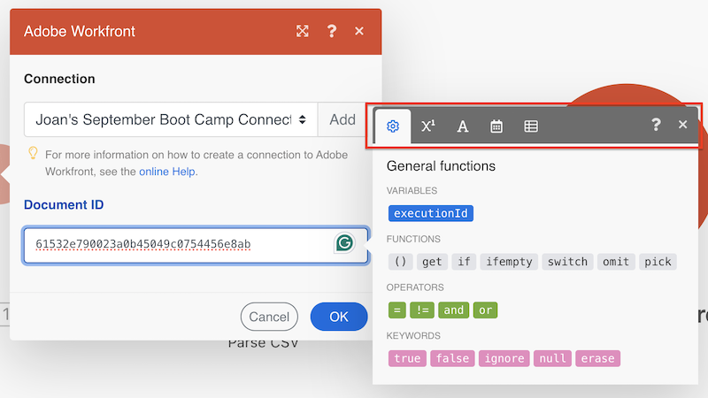

# Map items using functions

When you map items, you can use functions to create simple or complex formulas. The functions available are similar to functions in Excel and in some programming languages:

* They evaluate general logic, math, text, dates, and arrays. 
* They let you perform conditional logic and transformations of item values, such as converting a text to uppercase, trimming text, converting a date into a different format, and more. 

<!--For more information, see [Map information from one module to another in Adobe Workfront Fusion](../../workfront-fusion/mapping/map-information-between-modules.md).-->

## Access requirements

+++ Expand to view access requirements for the functionality in this article.

You must have the following access to use the functionality in this article:

<table style="table-layout:auto">
 <col> 
 <col> 
 <tbody> 
  <tr> 
   <td role="rowheader">[!DNL Adobe Workfront] plan</td> 
   <td> 
Any
 </td> 
  </tr> 
  <tr data-mc-conditions=""> 
   <td role="rowheader">[!DNL Adobe Workfront] license</td> 
   <td> 
New: [!UICONTROL Standard]

Or

Current: [!UICONTROL Work] or higher
 </td> 
  </tr> 
  <tr> 
   <td role="rowheader">[!DNL Adobe Workfront Fusion] license**</td> 
   <td>
   
Current: No [!DNL Workfront Fusion] license requirement.

   
Or

   
Legacy: Any 

   </td> 
  </tr> 
  <tr> 
   <td role="rowheader">Product</td> 
   <td>
   
New:
 <ul><li>[!UICONTROL Select] or [!UICONTROL Prime] [!DNL Workfront] Plan: Your organization must purchase [!DNL Adobe Workfront Fusion].</li><li>[!UICONTROL Ultimate] [!DNL Workfront] Plan: [!DNL Workfront Fusion] is included.</li></ul>
   
Or

   
Current: Your organization must purchase [!DNL Adobe Workfront Fusion].

   </td> 
  </tr>
  <tr data-mc-conditions=""> 
   <td role="rowheader">Access level configurations*</td> 
   <td> 
     
You must be a [!DNL Workfront Fusion] administrator for your organization.

     
You must be a [!DNL Workfront Fusion] administrator for your team.

   </td> 
  </tr> 
   </td> 
  </tr> 
 </tbody> 
</table>

<!--For more detail about the information in this table, see [Access requirements in Workfront documentation](/help/quicksilver/administration-and-setup/add-users/access-levels-and-object-permissions/access-level-requirements-in-documentation.md).-->

<!--For information on [!DNL Adobe Workfront Fusion] licenses, see [[!DNL Adobe Workfront Fusion] licenses](../../workfront-fusion/get-started/license-automation-vs-integration.md).-->

+++

## Mapping tab overview

To open the [!UICONTROL mapping] panel for a field:

1. In a scenario module, click the field where you want to map a value.

   The mapping panel opens
1. (Conditional) If the mapping panel does not open, enable the Map toggle above the field.

### Mapping panel tabs

The mapping panel includes the following tabs. Each tab includes functions and keywords for that type of data.

| Type of functions | For more information, see:|
|---|---|
| **Map from other modules**  | [Map information from one module to another](/help/workfront-fusion/create-scenarios/map-data/map-data-from-one-to-another.md) |
|  **General functions** |[General functions](/help/workfront-fusion/references/mapping-panel/functions/general-functions.md) |
| **Math functions** | [Math functions](/help/workfront-fusion/references/mapping-panel/functions/math-functions.md)|
| **Text and binary functions** | [String functions](/help/workfront-fusion/references/mapping-panel/functions/string-functions.md)|
| **Date and time**   | <ul><li>[Date and time functions](/help/workfront-fusion/references/mapping-panel/functions/date-and-time-functions.md)</li><li>[Tokens for date and time formatting](/help/workfront-fusion/references/mapping-panel/functions/tokens-for-date-and-time-formatting.md)</li><li> [Tokens for date and time parsing](/help/workfront-fusion/references/mapping-panel/functions/tokens-for-date-and-time-parsing.md)</li></ul> |
|**Functions for working with arrays**  |[Array functions](/help/workfront-fusion/references/mapping-panel/functions/array-functions.md)|

## Insert functions into fields

To insert a function into a field:

1. Click the function name.

   Or

   Drag the function into the field.

>[!BEGINSHADEBOX]

   **Example:** Some data types prevent users from entering more than a certain number of characters. You can use the substring function to limit a value to a certain number of characters.

   In this example, the substring function limits project name to 50 characters.

   

>[!ENDSHADEBOX]

## Nesting functions

You can nest functions within each other.

>[!BEGINSHADEBOX]

   **Example:** 

   In this example, the substring function limits the trimmed project name to 50 characters.

   

>[!ENDSHADEBOX]

## Use [!DNL Google Sheets] functions

If [!DNL Workfront Fusion] does not feature a function you want to use, but it is featured by [!DNL Google Sheets], you can use it by following these steps:

1. In [!DNL Google Sheets], create a new empty spreadsheet.
1. In [!DNL Workfront Fusion], open your scenario.
1. Add the **[!DNL Google Sheets]** >**[!UICONTROL Update a cell]** module to the scenario.

   <!--For instructions on adding a module, see [Add a module in a scenario](../../workfront-fusion/scenarios/create-a-scenario.md#add) in the article [Create a scenario](../../workfront-fusion/scenarios/create-a-scenario.md).-->

1. Configure the module:

   1. Choose the newly created spreadsheet in the **[!UICONTROL Spreadsheet]** field.
   1. Insert your formula containing the [!DNL Google Sheets] function(s) into the **[!UICONTROL Value]** field.

      You can use the output of preceding modules as usual.

      

1. Insert the **[!UICONTROL Google Sheets] >[!UICONTROL Get a cell]** module to obtain the calculated result.
1. Configure the module, using the same Cell ID that you used in step 4.

   
