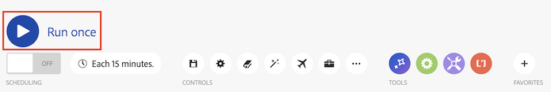

# The scenario editor

The scenario editor allows you to create and edit scenarios in a visual interface.

## Access requirements

+++ Expand to view access requirements for the functionality in this article.

<table style="table-layout:auto">
 <col> 
 <col> 
 <tbody> 
  <tr> 
   <td role="rowheader">Adobe Workfront package</td> 
   <td> 
Any Adobe Workfront Workflow package and any Adobe Workfront Automation and Integration package

Workfront Ultimate

Workfront Prime and Select packages, with an additional purchase of Workfront Fusion.
 </td> 
  </tr> 
  <tr data-mc-conditions=""> 
   <td role="rowheader">Adobe Workfront licenses</td> 
   <td> 
Standard

Work or higher
 </td> 
  </tr> 
  <tr> 
   <td role="rowheader">Product</td> 
   <td>
   
If your organization has a Select or Prime Workfront package that does not include Workfront Automation and Integration, your organization must purchase Adobe Workfront Fusion.</li></ul>
   </td> 
  </tr>
 </tbody> 
</table>

For more detail about the information in this table, see [Access requirements in documentation](/help/workfront-fusion/references/licenses-and-roles/access-level-requirements-in-documentation.md).

+++

## Open the scenario editor and add a module:

1. Click **[!UICONTROL Scenarios]**  in the left panel.
1. Click the question mark icon , then find and click the app or service that you want to start with. For detailed information about configuring a module, see [Configure a module](/help/workfront-fusion/create-scenarios/add-modules/configure-a-modules-settings.md).

## Available scenario editor actions

### Run your scenario

| Action | Details |
|----------|----------|
| Test-run the scenario    | Verify that the scenario runs as you expect before you activate it. Once activated, the scenario will execute according to its schedule. If everything does not run as expected, see [Add error handling](/help/workfront-fusion/create-scenarios/config-error-handling/error-handling.md) to learn how to handle errors.   |

### Scheduling 

| Action | Details |
|----------|----------|
| Schedule the scenario | By default, a scenario runs every 15 minutes. You can change this by defining when and how often an activated scenario runs. Fusion scenarios can be scheduled to run as often as every 5 minutes. For more information, see [Schedule a scenario](/help/workfront-fusion/create-scenarios/config-scenarios-settings/schedule-a-scenario.md).  |

### Controls

You may need to click on the three-dot icon in the Controls area to view some of these controls.

| Action | Details |
|----------|----------|
| Save 

  | After saving your scenario, a new version will be available under the three-dot menu in case you need to access it in the future. Previously saved scenario versions are only available for 60 days.   |
| Scenario settings 

    | The scenario settings panel contains advanced settings for the scenario. For more information about the settings available, see [Configure scenario settings](/help/workfront-fusion/create-scenarios/config-scenarios-settings/configure-scenario-settings.md).    |
| Notes  

  | Make notes about the scenario. Other users can view these notes when they are in the scenario.   |
| Auto-align 

   | Auto-align the modules in your scenario.  |
| Search modules   
 | Enter a search term to locate a module, then click the search results to be taken to that module. You can search by module name, ID, type, or application.   |
| Explain flow  
 
 | View an animation where moving dots show how data flows through the scenario.   |
| DevTool 

   | Using the DevTool, you can check all the manual runs of your scenario, review all the performed operations, and see the details of every API call performed. You can see which module, operation, or single response caused the error, and use that knowledge to refine your scenario. For more information, see [Debug a scenario](/help/workfront-fusion/manage-scenarios/debug-a-scenario.md).   |
| Export Blueprint  
 
 | Export a blueprint of the current scenario.   |
| Import Blueprint  
 
 | Import a previously exported scenario blueprint.   |
| Previous Version  
 
 | View previous versions of this scenario.   |

### Tools

| Action | Details |
|----------|----------|
| Flow control    | Configure settings to control the way data flows through it. For more information, [see link needed].  |
| Tools    | The tools section contains several useful modules that can enhance your scenarios. For more information, [see link needed]. |
| Text parser    | Use the Text parser tool to parse text for use in other scenario modules. The Text parser does not require a connection. For more information, [see link needed].   |

### Favorites

You can use the Favorites icon to add modules you use often.

