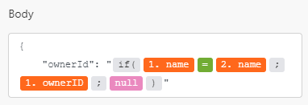

# Mapping overview

Mapping is the process of assigning a module's outputs to another module's input fields.

The mapping panel displays when you click a field where you can  insert a value outputted from a preceding module in a scenario. Within a module, in any field that is available for mapping, you can create a formula using any combination of functions and mapped items from the mapping panel with static text that you type. These elements can be nested inside each other.

<!--## Access requirements

You must have the following access to use the functionality in this article:

<table style="table-layout:auto">
 <col> 
 <col> 
 <tbody> 
  <tr> 
    <td role="rowheader">[!DNL Adobe Workfront] plan*</td> 
   <td> 
[!DNL Pro] or higher
 </td> 
  </tr> 
  <tr data-mc-conditions=""> 
   <td role="rowheader">[!DNL Adobe Workfront] license*</td> 
   <td> 
[!UICONTROL Plan], [!UICONTROL Work]
 </td> 
  </tr> 
  <tr> 
   <td role="rowheader">[!UICONTROL Adobe Workfront Fusion] license**</td> 
   <td>
   
Current license requirement: No [!DNL Workfront Fusion] license requirement.

   
Or

   
Legacy license requirement: [!UICONTROL [!DNL Workfront Fusion] for Work Automation and Integration] 

   </td> 
  </tr> 
  <tr> 
   <td role="rowheader">Product</td> 
   <td>
   
Current product requirement: If you have the [!UICONTROL Select] or [!UICONTROL Prime] [!DNL Adobe Workfront] Plan, your organization must purchase [!DNL Adobe Workfront Fusion] as well as [!DNL Adobe Workfront] to use functionality described in this article. [!DNL Workfront Fusion] is included in the [!UICONTROL Ultimate] [!DNL Workfront] plan.

   
Or

   
Legacy product requirement: Your organization must purchase [!DNL Adobe Workfront Fusion] as well as [!DNL Adobe Workfront] to use functionality described in this article.

   </td> 
  </tr> 
 </tbody> 
</table>

To find out what plan, license type, or access you have, contact your [!DNL Workfront] administrator.

For information on [!DNL Adobe Workfront Fusion] licenses, see [[!DNL Adobe Workfront Fusion] licenses](../../workfront-fusion/get-started/license-automation-vs-integration.md).-->

## Bundles and items

The operation of a module produces zero, one, or more bundles as its output. A bundle consists of one or more items.

You can map these items to fields in later modules.

After the module has run, you can view the output by clicking the magnifying glass icon above the module. Here, you can view a log of all of the bundle or bundles that the module output. Each bundle shows the items it contains and the values of those items.

>[!BEGINSHADEBOX]

**Example:** This example shows the module [!UICONTROL Email] > [!UICONTROL Watch emails]. You can see that it performed 1 operation producing a single bundle that contains various items such as `Date`, `Email ID (UID)`, `size`, and so on.

>[!ENDSHADEBOX]

>[!NOTE]
>
>The outputs from modules wrapped between an [!UICONTROL Iterator] and [!UICONTROL Aggregator] are not accessible beyond the [!UICONTROL Aggregator] module.

## Formulas

You can map multiple items into a field, combine them with fixed values, and use operators and functions to build complex formulas:

 

You can find the functions and operators in the mapping panel. Functions and operators are sorted into different tabs based on the type of data they handle.

The first tab  displays the items that you can map from other modules.

The other tabs contain the following types of functions:

| Type of functions | For more information, see:|
|---|---|
|  **General functions** |[General functions](/help/workfront-fusion/references/mapping-panel/functions/general-functions.md) |
| **Math functions** | [Math functions](/help/workfront-fusion/references/mapping-panel/functions/math-functions.md)|
| **Text and binary functions** | [String functions](/help/workfront-fusion/references/mapping-panel/functions/string-functions.md)|
| **Date and time**   | <ul><li>[Date and time functions](/help/workfront-fusion/references/mapping-panel/functions/date-and-time-functions.md)</li><li>[Tokens for date and time formatting](/help/workfront-fusion/references/mapping-panel/functions/tokens-for-date-and-time-formatting.md)</li><li> [Tokens for date and time parsing](/help/workfront-fusion/references/mapping-panel/functions/tokens-for-date-and-time-parsing.md)</li></ul> |
|**Functions for working with arrays**  |[Array functions](/help/workfront-fusion/references/mapping-panel/functions/array-functions.md)|

>[!TIP]
>
>When you create a complex formula that you want to reuse in another field, you can click the field that contains the combination, use Cmd-A or Ctrl-A to select it, then copy and paste it into the other field.

For more information on mapping items using functions, see [Map items using functions](/help/workfront-fusion/create-scenarios/map-data/map-using-functions.md).

## Collections

Items can contain multiple values of various types. These are collection-type items.

Collection-type bundles display `(Collection)` next to the bundle label in the module output. 

In most cases, you map the collection's elements instead of mapping the item that represents the whole collection.

To locate a collection's element in the mapping panel, click the arrow next to the collection.

For more information about collections, see [Item data types](/help/workfront-fusion/references/mapping-panel/data-types/item-data-types.md).

## Arrays

Items can contain multiple values of the same type. These are array-type items.

Array-type bundles display `(Array)` next to the bundle label in the module output.

In the mapping panel, arrays display with square bracksts. You can identify an array type item by the square brackets at the end of the item's label. To locate specific array element in the mapping panel, click the arrow next to the array.

For information about mapping arrays and array elements, see [Map arrays and array elements](/help/workfront-fusion/create-scenarios/map-data/map-an-array.md).
