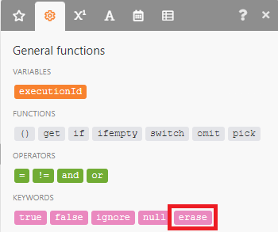
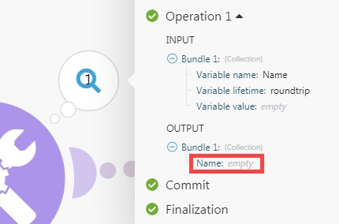

# Module overview

Adobe Workfront Fusion distinguishes five types of modules: 

* Action modules
* Search modules
* Trigger modules
* Aggregators
* Iterators

Aggregators and Iterators are for advanced scenarios.

## Action modules

Action modules are the most common type of module. A typical action module performs an action and returns a single bundle, which then passes on to the next module for processing.

Unlike trigger modules, action modules can be placed at the beginning, middle or end of a scenario. 

Scenarios can contain an unlimited number of action modules, although large numbers of modules (150+) may affect performance.

>[!BEGINSHADEBOX]

**Examples:** 

* **[!DNL Workfront] > [!UICONTROL Upload a file]** sends a file to [!DNL Workfront] and returns its identifier.
* **[!UICONTROL Image] > [!UICONTROL Resize]** receives an image, resizes it to specified dimensions, and passes the resized image on to the next action.

>[!ENDSHADEBOX]

The Action type has four subtypes:

* Create
* Read
* Update
* Delete

The Update subtype includes the following three operations:

* **Erase the content of a field**. This operation takes place when the content of the field is evaluated to the `erase` keyword (not to be confused with `empty`).

  

* **Leave the content of a field unchanged**. This operation takes place when the field is left empty or the content of the field is evaluated to empty (represented via null in JSON).

  

* **Replace the content of a field**. This operation takes place in all other cases than those two described above.

>[!NOTE]
>
>* If you do not see the `erase` keyword in the mapping panel, the module is not an update module or it has not been updated to the latest specifications for the app.
>* `Empty` does not change the field content. If it is necessary to erase the field, you can use the following formula:
>
>   
>
>* Leaving a field unchanged when its content is evaluated as empty is currently not supported.

## Search modules

Search modules return zero, one, or more bundles, which then pass on to the next module for processing.

You can place Search modules at the beginning, middle, or end of a scenario.

Scenarios can contain an unlimited number of Search modules, although large numbers of modules (150+) may affect performance.

>[!BEGINSHADEBOX]

**Example:**

**[!DNL Workfront] > [!UICONTROL Read Related Records]**  reads records that match the search query you specify, in a particular parent object.

>[!ENDSHADEBOX]

## Trigger modules

Triggers generate bundles when there has been a change in a given service, such as the creation or update of a record.

Triggers return zero, one, or more bundles, which then pass to the next module for processing.

Because Triggers cause scenarios to begin execution, they can be placed only at the beginning of a scenario.

Each scenario can contain only one Trigger.

[!DNL Workfront Fusion] uses two types of triggers: Polling triggers and Instant triggers.

### Polling triggers

Polling triggers regularly poll a given service even if there has been no change since the previous scenario run. We recommend that you schedule a scenario containing a polling trigger to run at regular intervals. If there is a change that matches the configuration of the trigger, the trigger returns bundles containing information about the change. If there is no change that matches the configuration, the trigger does not output any bundles. 

For instructions on scheduling a scenario, see [Schedule a scenario](/help/workfront-fusion/create-scenarios/config-scenarios-settings/schedule-a-scenario.md).

Polling triggers allow you to select the first bundle that they should output via a panel that displays automatically after you save a trigger or change the trigger settings. This selection affects only the first execution of the module. After the module has executed once, subsequent executions watch only for changes that occur after the most recent execution.

For more information, see [Choose where a trigger module starts](/help/workfront-fusion/create-scenarios/add-modules/choose-where-trigger-module-starts.md).

>[!BEGINSHADEBOX]

**Examples:** 

* **[!DNL Workfront] > [!UICONTROL Watch records]** returns records that were newly added after the last time the scenario was run.

* **[!DNL Google Sheets] > [!UICONTROL Watch Rows]** returns new rows added after the last time the scenario was run.

>[!ENDSHADEBOX]

### Instant triggers

Instant triggers enable a service to notify [!DNL Workfront Fusion] about a change immediately after it occurs. We recommend that you schedule a scenario containing an instant trigger to run immediately. 

For instructions, see [Schedule a scenario](/help/workfront-fusion/create-scenarios/config-scenarios-settings/schedule-a-scenario.md).

For ifor details on how the incoming data is handled by an instant trigger, see [Instant triggers (webhooks)](/help/workfront-fusion/references/modules/webhooks-reference.md) for details on how the incoming data is handled.

>[!BEGINSHADEBOX]

**Examples:** 

* **[!DNL Workfront] > [!UICONTROL Watch Events]** returns information when a certain type of event occurs in Workfront, such as the creation of a task.
* **[!DNL Google Sheets] > [!UICONTROL Watch Changes]** returns information whenever a cell is updated.

>[!ENDSHADEBOX]

## Aggregators

An Aggregator module accumulates multiple bundles into a single bundle.

Aggregators return only one bundle, which then passes on to the next module for further processing.

You can place Aggregators only in the middle of a scenario.

Scenarios can contain an unlimited number of aggregators, although large numbers of modules (150+) may affect performance.

>[!BEGINSHADEBOX]

**Examples:** 

* **[!UICONTROL Archive] > [!UICONTROL Create an archive]** compresses multiple files into a zip archive.
* **[!UICONTROL CSV] > [!UICONTROL Aggregate to CSV]** merges multiple strings from a CSV file into a single row.
* **[!UICONTROL Tools] > [!UICONTROL Text aggregator]** combines several strings together into a single string.

>[!ENDSHADEBOX]

For more information, see [Aggregator module](/help/workfront-fusion/references/modules/aggregator-module.md).

## Iterators

An Iterator is a type of module that splits arrays into separate bundles.

Iterators return one or more bundles, which then pass on to the next module for processing.

You can place Iterators only in the middle of a scenario.

Scenarios can contain an unlimited number of iterators, although large numbers of modules (150+) may affect performance.

>[!BEGINSHADEBOX]

**Example:**

**[!UICONTROL Email] > [!UICONTROL Retrieve attachments]** breaks an array of attachments into separate bundles.

>[!ENDSHADEBOX]

For more information, see [Iterator module](/help/workfront-fusion/references/modules/iterator-module.md) and [Map an array](/help/workfront-fusion/create-scenarios/map-data/map-an-array.md).
