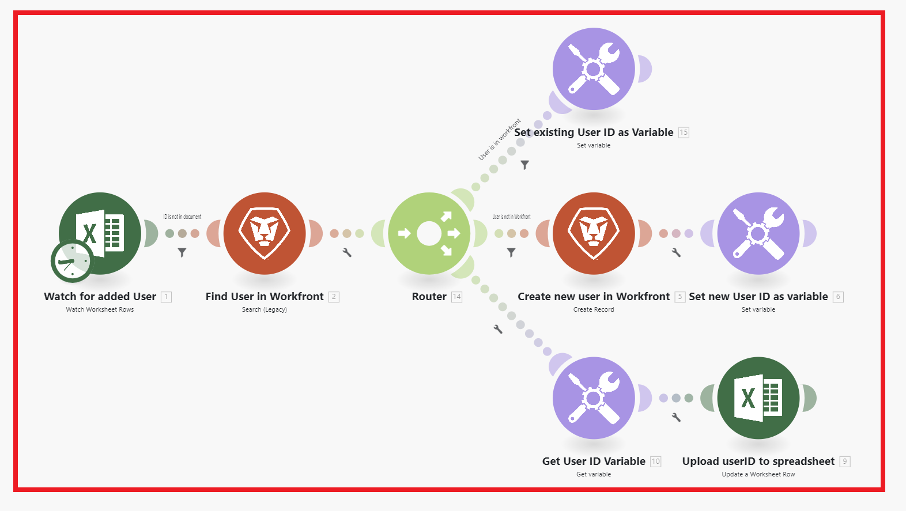

# Scenario elements overview

A scenario is built of different elements. Understanding the terminology of those elements makes it easier to use the documentation.

## Scenario

A scenario is a user-created series of automated steps, created to move and manipulate data. "Scenario" refers to the entire group of connected steps.

## Trigger

A scenario begins with a **trigger**. The trigger watches for new and updated data, and starts the scenario when certain conditions configured in the module apply. Triggers can be configured to start a scenario on a schedule (polling), or whenever data changes occur (instant). 

## Module

The trigger is followed by a number of **modules**. A module represents single step in a scenario that performs a specific function. Modules are configured and chained together to create scenarios.

## Route

A scenario may be divided into **routes**. A route is a section of the scenario that may or may not be used for a given bundle of data. Routes are set up using a router module and filters.

## Scenario segment

A section of a scenario consisting of a series of modules that all connect to the same application. Scenario segments often represent a short workflow in the application.

## Connector

A connector is the set of modules for a given application. Workfront Fusion offers connectors to many common work applications, such as Workfront, Salesforce, and Jira.

