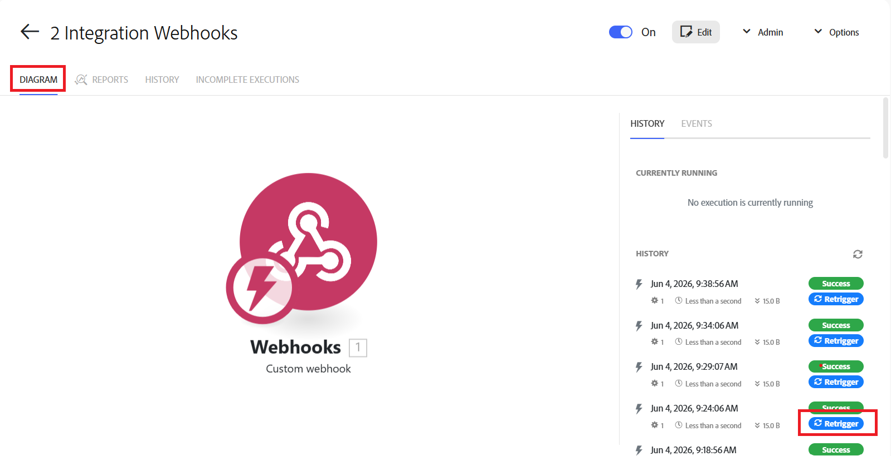

# Retrigger a specific scenario execution

You can retrigger a specific scenario execution to process the data using an updated scenario blueprint, or to view its data flow. When you retrigger an execution, the scenario runs using that execution's data. 

For example, if you update a scenario to add an action such as creating an issue, you can retrigger an execution that occurred before the update. The updated scenario will run using the original scenario's triggering event, but will include the updated action. In this example, the scenario creates an issue as part of the new execution.

Retriggering is available for scenarios that have webhook triggers, and for child scenarios.

When retriggering a scenario that uses a webhook, the original webhook event can be used again, so you do not have to recreate the event to retrigger the scenario.

When using chained scenarios, retriggering can also be applied to a child scenario. The child scenario can be retriggered using the data sent from the parent scenario in the original execution, without retriggering the parent.

For more information on webhooks, see [Instant triggers (webhooks)](/help/workfront-fusion/references/modules/webhooks-reference.md).

For more information on chaining scenarios, see [Chain multiple scenarios together](/help/workfront-fusion/create-scenarios/plan-a-scenario/chain-scenarios.md).

## Access requirements

+++ Expand to view access requirements for the functionality in this article.

<table style="table-layout:auto">
 <col> 
 <col> 
 <tbody> 
  <tr> 
   <td role="rowheader">Adobe Workfront package</td> 
   <td> 
Any Adobe Workfront Workflow package and any Adobe Workfront Automation and Integration package

Workfront Ultimate

Workfront Prime and Select packages, with an additional purchase of Workfront Fusion.
 </td> 
  </tr> 
  <tr data-mc-conditions=""> 
   <td role="rowheader">Adobe Workfront licenses</td> 
   <td> 
Standard

Work or higher
 </td> 
  </tr> 
  <tr> 
   <td role="rowheader">Product</td> 
   <td>
   
If your organization has a Select or Prime Workfront package that does not include Workfront Automation and Integration, your organization must purchase Adobe Workfront Fusion.</li></ul>
   </td> 
  </tr>
 </tbody> 
</table>

For more detail about the information in this table, see [Access requirements in documentation](/help/workfront-fusion/references/licenses-and-roles/access-level-requirements-in-documentation.md).

+++

## Retrigger an execution

You can retrigger a scenario execution from the scenario's Diagram, the scenario's History area, or the specific scenario execution's page.

### Retrigger an execution from the Scenario Diagram 

1. Click the **[!UICONTROL Scenarios]** tab in the left panel.
1. Select the scenario that ran the execution that you want to retrigger.

   The scenario's Diagram opens.
1. Locate the execution that you want to retrigger in the Executions list on the right side of the page. 
1. Click **Retrigger** for that scenario. 
  

### Retrigger an execution from the Scenario History 

1. Click the **[!UICONTROL Scenarios]** tab in the left panel.
1. Select the scenario that ran the execution that you want to retrigger.

   The scenario's Diagram opens.

1. Click the **History** tab just below the scenario name.
1. Locate the execution that you want to retrigger. You can use Fulltext search to locate it if necessary.
1. Click **Retrigger** for that scenario. 
  

### Retrigger a scenario from the scenario execution page

1. Click the **[!UICONTROL Scenarios]** tab in the left panel.
1. Select the scenario that ran the execution that you want to retrigger.

   The scenario's Diagram opens.
1. Locate the execution that you want to retrigger in the Executions list on the right side of the page. 
1. Click the execution to open it.
1. On the execution page, click **Retrigger**.
  
 

