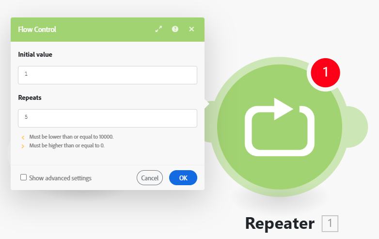

# Flow control in Adobe Workfront Fusion

When you are creating or editing a scenario, you can configure settings to control the way data flows through it.

## Access requirements

You must have the following access to use the functionality in this article:

<table style="table-layout:auto"> 
 <col> 
 <col> 
 <tbody> 
  <tr> 
   <td role="rowheader">[!DNL Adobe Workfront] plan*</td>
  <td> 
[!UICONTROL Pro] or higher
 </td>
  </tr> 
  <tr data-mc-conditions=""> 
   <td role="rowheader">[!DNL Adobe Workfront] license*</td>
   <td> 
[!UICONTROL Plan], [!UICONTROL Work]
 </td> 
  </tr> 
  <tr> 
   <td role="rowheader">[!DNL Adobe Workfront Fusion] license**</td> 
   <td>
   
Current license requirement: No [!DNL Workfront Fusion] license requirement.

   
Or

   
Legacy license requirement: [!UICONTROL [!DNL Workfront Fusion] for Work Automation and Integration],  [!UICONTROL [!DNL Workfront Fusion] for Work Automation]

   </td> 
  </tr> 
  <tr> 
   <td role="rowheader">Product</td> 
   <td>
   
Current product requirement: If you have the [!UICONTROL Select] or [!UICONTROL Prime] [!DNL Adobe Workfront] Plan, your organization must purchase [!DNL Adobe Workfront Fusion] as well as [!DNL Adobe Workfront] to use functionality described in this article. [!DNL Workfront Fusion] is included in the [!UICONTROL Ultimate] [!DNL Workfront] plan.

   
Or

   
Legacy product requirement: Your organization must purchase [!DNL Adobe Workfront Fusion] as well as [!DNL Adobe Workfront] to use functionality described in this article.

   </td> 
  </tr> 
 </tbody> 
</table>

To find out what plan, license type, or access you have, contact your [!DNL Workfront] administrator.

For information on [!DNL Adobe Workfront Fusion] licenses, see [[!DNL Adobe Workfront Fusion] licenses](/help/workfront-fusion/set-up-and-manage-workfront-fusion/licensing-operations-overview/license-automation-vs-integration.md).

## Repeater

You can use a [!UICONTROL Repeater] module to repeat a task a given number of times. A [!UICONTROL Repeater] module generates bundles, one after another.

For example, you could use a [!UICONTROL Repeater] module to send five emails with the subjects "Hello 1," "Hello 2," and so on, by connecting the **[!UICONTROL Email] >[!UICONTROL Send me an email]** module to the [!UICONTROL Repeater] module.

To use a [!UICONTROL Repeater] module:

1. Click the [!UICONTROL Flow Control] icon  at the bottom of the screen, then click **[!UICONTROL Repeater]** in the menu that displays.
1. Click the [!UICONTROL Repeater] bundle, then click **[!UICONTROL Connect automatically]** in the box that displays.
1. In the [!UICONTROL Flow Control] box that appears, type the number of repetitions (outputted bundles) you want in the **[!UICONTROL Repeats]** box.

   In our email example, you would type 5.

   

   The value of the item increases in each repetition by this value specified in the **[!UICONTROL Step]** field, which you can view by selecting **[!UICONTROL Show advanced settings]**. This number is 1 by default.

1. Click **[!UICONTROL OK]** to close the **[!UICONTROL Flow Control]** box.

1. Click the app or service module connected to the [!UICONTROL Repeater] module.
1. In the box that appears, type the information that you want to repeat.

   In our email example, you would type Hello in the [!UICONTROL Subject] box, then map `i` from the repeater module.

   

| Item | Description |
|---|---|
| [!UICONTROL Initial value] | Enter or map the number that you want the module to set as `i` in the first iteration. The default value is 1. |
| [!UICONTROL Repeats] | Enter or map the number of times that you want the module to repeat. This number must be greater than or equal to 0, and less than or equal to 10,000. |
| [!UICONTROL Step] | This is the number by which the module increases the value of `i`. The default value is 1. |

{style="table-layout:auto"}

>[!NOTE]
>
>The number of repeats is not determined by the value of `i`, as it would be in a loop in programming. The module will repeat the number of times indicated in the [!UICONTROL Repeats] field. The value `i` changes with each iteration of the [!DNL repeater] module, and can be mapped to later modules. The example above maps the value of `i` into the Hello message, resulting in messages that read "Hello 1," Hello 2," and so on.

## [!UICONTROL Iterator]

An [!UICONTROL Iterator] is a special type of module that converts an array into a series of bundles. Each array item will be a separate bundle in the [!UICONTROL Iterator] module output. For more information, see [Iterator module](/help/workfront-fusion/references/modules/iterator-module.md).

## Array aggregator

An array aggregator is a special type of module which allows to merge several bundles into one single bundle. For more information, see [Aggregator module](/help/workfront-fusion/references/modules/aggregator-module.md).

## [!UICONTROL Router]

The [!UICONTROL Router] module allows you to branch your flow into several routes and process the data within each route differently. Once a [!UICONTROL Router] module receives a bundle, it forwards it to each connected route in the order the routes were attached to the [!UICONTROL Router] module. For more information, see [Router module in [!DNL Adobe Workfront Fusion]](/help/workfront-fusion/create-scenarios/add-modules/router-module.md).

<!--

<h2>Directives</h2>

The error handling directives allow you to control how your scenario reacts to errors. For more information, see <a href="/help/workfront-fusion/create-scenarios/config-error-handling/advanced-error-handling.md" class="MCXref xref">Advanced error handling in Adobe Workfront Fusion</a> and <a href="/help/workfront-fusion/references/errors/directives-for-error-handling.md" class="MCXref xref">Directives for error handling in Adobe Workfront Fusion</a>.

-->
