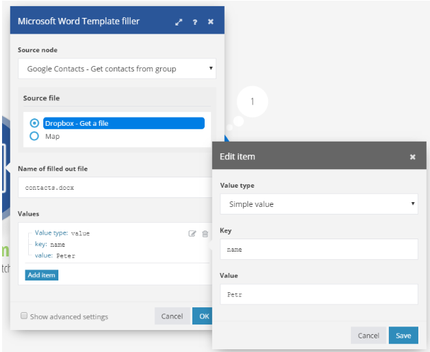
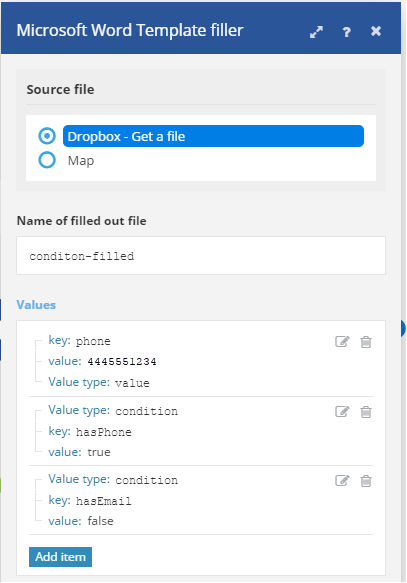
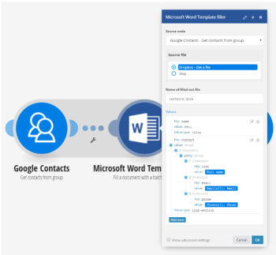

# [!DNL Microsoft Word Template] modules

In an [!DNL Adobe Workfront Fusion] scenario, you can automate workflows that use [!DNL Microsoft Word Templates], as well as connect it to multiple third-party applications and services.

For instructions on creating a scenario, see the articles under [Create scenarios: article index](/help/workfront-fusion/create-scenarios/create-scenarios-toc.md).

For information about modules, see the articles under [Modules: article index](/help/workfront-fusion/references/modules/modules-toc.md).

## Access requirements

You must have the following access to use the functionality in this article:

<table style="table-layout:auto"> 
 <col> 
 <col> 
 <tbody> 
  <tr> 
   <td role="rowheader">[!DNL Adobe Workfront] plan*</td>
  <td> <p>[!UICONTROL Pro] or higher</p> </td>
  </tr> 
  <tr data-mc-conditions=""> 
   <td role="rowheader">[!DNL Adobe Workfront] license*</td>
   <td> <p>[!UICONTROL Plan], [!UICONTROL Work]</p> </td> 
  </tr> 
  <tr> 
   <td role="rowheader">[!DNL Adobe Workfront Fusion] license**</td> 
   <td> <p>[!UICONTROL [!DNL Workfront Fusion] for Work Automation and Integration] </p> </td> 
  </tr> 
  <tr> 
   <td role="rowheader">Product</td> 
   <td>Your organization must purchase [!DNL Adobe Workfront Fusion] as well as [!DNL Adobe Workfront] to use functionality described in this article.</td> 
  </tr> <!--
   <tr data-mc-conditions="QuicksilverOrClassic.Draft mode"> 
    <td role="rowheader">Access level configurations*</td> 
    <td> 
      <p data-mc-conditions="QuicksilverOrClassic.Draft mode">You must be a Workfront Fusion administrator for your organization.</p>
     --> <!--
      <p data-mc-conditions="QuicksilverOrClassic.Draft mode">You must be a Workfront Fusion administrator for your team.</p>
     --> </td> 
   </tr>
 </tbody> 
</table>

To find out what plan, license type, or access you have, contact your [!DNL Workfront] administrator.

For information on [!DNL Adobe Workfront Fusion] licenses, see [[!DNL Adobe Workfront Fusion] licenses](/help/workfront-fusion/set-up-and-manage-workfront-fusion/licensing-operations-overview/license-automation-vs-integration.md).

## Prerequisites

In order to use [!DNL Miscrosoft Word Templates] with [!DNL Adobe Workfront Fusion], it is necessary to have an [!DNL Office 365] account. You can create one at www.office.com.


## Connecting the [!DNL Office] service to [!DNL Workfront Fusion]

For instructions about connecting your [!DNL Office] account to [!UICONTROL Workfront Fusion], see [Create a connection to [!UICONTROL Adobe Workfront Fusion] - Basic instructions](/help/workfront-fusion/create-scenarios/connect-to-apps/connect-to-fusion-general.md)

>[!NOTE]
>
>Some Microsoft apps use the same connection, which is tied to individual user permissions. Therefore, when creating a connection, the permissions consent screen displays any permissions that were previously granted to this user's connection, in addition to any new permissions needed for the current application. 
>
>For example, if a user has "Read table" permissions granted via the Excel connector and then creates a connection in the Outlook connector to read emails, the permissions consent screen will show both the already granted "Read table" permission and the newly required "Write email" permission.

## Using [!DNL Microsoft Word Templates] modules

You can use a [!DNL Microsoft Word Template] module to merge data from multiple web services into a [!DNL Microsoft Word] document.

For example, you could use this [!DNL Microsoft Word] template:


To create this document:


## About value tags

A [!DNL Microsoft Word] template is a regular [!DNL Microsoft Word] document (.docx file) with special tags in its text that determine where and how to merge or fill in data. There are three types of tags:

* [Simple value tag](#simple-value-tag) 
* [Condition tag](#condition-tag) 
* [Loop tag](#loop-tag)

### Simple value tag {#simple-value-tag}

A simple value tag is simply replaced with a corresponding value. The tag's name corresponds with the [!UICONTROL Key] field's value, which is placed inside double curly braces; for example, `{{name}}`.

**Example:** To create a document that says "Hi, Petr!", you could use a [!DNL Microsoft Word Template] module to create the following template:

```
> Hi {{name}}!
```

To do this, you would set up the module as follows:



### Condition tag {#condition-tag}

You can use a condition tag to wrap text that should be rendered only when certain conditions are met. To wrap the text, place it between opening and closing condition tags, such as "hasPhone" if the condition is whether or not the data includes a phone number. The name of an opening tag is prepended with a hash sign #, the name of a closing tag is prepended with a slash /, as shown in the example below.

**Example:** To produce a document that includes a customer's phone number if the input data includes a phone number, but no email address, you could use a [!DNL Microsoft Word Template] module and create the following template:

```
> {{#hasPhone}}Phone: {{phone}} {{/hasPhone}}
> {{#hasEmail}}Email: {{email}} {{/hasEmail}}
```

To do this, you would set up the module as follows:



In the document, the phone number would appear as follows:

```
> Phone: 4445551234
```

### Loop tag {#loop-tag}

You can use a loop tag, also known as a section tag, to repeat a section of text. Wrap the text by placing it between the opening and closing loop tags. The name of an opening tag is prepended with a hash sign #; the name of a closing tag is prepended with a slash /.

* [Loop tag with Fill out a document module](#loop-tag-with-fill-out-a-document-module) 
<!-- [Loop tag with Fill a document with a batch of data module](#loop-tag-with-fill-a-document-with-a-batch-of-data-module)-->

#### Loop tag with Fill out a document module {#loop-tag-with-fill-out-a-document-module}

**Example:** To produce a document that lists the name and phone number of each contact in a customer list, you could use a [!DNL Microsoft Word Template] module and create the following template:

```
> {{#contact}}
>     {{name}}, {{phone}}
> {{/contact}}
```

To do this, you would set up the module as follows:


The module would create the following document:

```
> Jan Toman, 4445551234
> Eduard Salo, 4445552345
``` 

<!--

#### Loop tag with Fill a document with a batch of data module {#loop-tag-with-fill-a-document-with-a-batch-of-data-module}

**Example:** You can export Google contacts into a table that you create using loop tags.

The first module loads the template. The next module retrieves all contacts from the group you specify in [!DNL Google Contacts]. The aggregator module aggregates all values retrieved from Google Contacts and merges them into the template. And the last module saves the filled template to the desired location.


You could use this scenario with the following template:


To do this, you would set up the module as follows:



The module would create the following document:


-->

## [!DNL Microsoft Word Template] modules

These modules do not require a connection.

* [Fill out a document](#fill-out-a-document) 
* [Fill a document with a batch of data](#fill-a-document-with-a-batch-of-data)

### [!UICONTROL Fill out a document] {#fill-out-a-document}

This transformer module lets you fill a document with data you specify. It can be used with simple values tags, conditional tags, or loop tags.

<table style="table-layout:auto"> 
 <col> 
 <col> 
 <tbody> 
  <tr> 
   <td role="rowheader">[!UICONTROL Start delimiter of the text being replaced]</td> 
   <td> <p>Enter the character(s) that you want to mark the beginning of the text being replaced. </p> <p class="example" data-mc-autonum="<b>Example: </b>"><span class="autonumber"><span><b>Example: </b></span></span>Enter <code>[[</code> if you want to replace a text similar to this one: <code>[[replace_me]]</code></p> </td> 
  </tr> 
  <tr> 
   <td role="rowheader"> <p>[!UICONTROL End delimiter of the text being replaced]</p> </td> 
   <td> <p>Enter the character(s) that you want to mark the end of the text being replaced. </p> <p class="example" data-mc-autonum="<b>Example: </b>"><span class="autonumber"><span><b>Example: </b></span></span>Enter <code>]]</code> if you want to replace a text similar to this one: <code>[[replace_me]]</code></p> </td> 
  </tr> 
  <tr> 
   <td role="rowheader">[!UICONTROL Source file]</td> 
   <td> <p> Map the file you want to upload from the previous module (for example, the HTTP &gt; Get a File or Dropbox &gt; Get a file module). Or enter the data file manually.</p> </td> 
  </tr> 
  <tr> 
   <td role="rowheader">[!UICONTROL Name of filled out file]</td> 
   <td>Enter a file name (including extension) for the target output file.</td> 
  </tr> 
  <tr> 
   <td role="rowheader">[!UICONTROL Data source]</td> 
   <td> <p>Select an option to indicate whether the data you're using is from a form or from a raw data collection (unprocessed computer data).</p> </td> 
  </tr> 
  <tr> 
   <td role="rowheader">[!UICONTROL Values]</td> 
   <td> <p>This must be an array of collections, where:</p> 
    <ul> 
     <li>Each collection corresponds to one data entry and contains one item <code>entry</code></li> 
     <li>Item <code>entry </code>contains a collection of the <code>key </code>and <code>value</code></li> 
     <li>Item <code>key </code>contains the tag's name</li> 
     <li>item <code>value </code>contains the tag's value</li> 
    </ul> 
    <p>To add an entry:</p>
    <ol> 
     <li> Click <b>[!UICONTROL Add Item]</b>. </li> 
     <li>Select the value type of the entry.</li> 
     <li>Add the name and value. For more information, see the example for the chosen value type in this article. 
      <ul> 
       <li><a href="#simple-value-tag" class="MCXref xref">Simple value tag</a></li> 
       <li><a href="#condition-tag" class="MCXref xref">Condition tag</a></li> 
       <li><a href="#loop-tag" class="MCXref xref">Loop tag</a></li> 
      </ul></li> 
    </ol> </td> 
  </tr> 
 </tbody> 
</table>

### [!UICONTROL Fill a document with a batch of data] {#fill-a-document-with-a-batch-of-data}

This aggregator module is useful if your data entries come as separate bundles. With this module, you can easily set up the structure required for the Value field and it map items to each value item. In contrast to the Fill out a document module, the Values field in the Fill a document with a batch of data module allows only a single entry containing variables.

You can also use this module also if your data entries come as an array, by using the *Iterator* module to transform the content of the array to a series of bundles.

The actual values are created and populated for each incoming bundle. The template is produced after all input bundles are processed.

This aggregator module is especially useful for creating lists or reports.

<table style="table-layout:auto"> 
 <col> 
 <col> 
 <tbody> 
  <tr> 
   <td role="rowheader">[!UICONTROL Source Module]</td> 
   <td>Select the module that is the source of your text.</td> 
  </tr> 
  <tr> 
   <td role="rowheader">[!UICONTROL Start delimiter of the text being replaced]</td> 
   <td> <p>Enter the character(s) that you want to mark the beginning of the text being replaced. </p> <p class="example" data-mc-autonum="<b>Example: </b>"><span class="autonumber"><span><b>Example: </b></span></span>Enter <code>[[</code> if you want to replace a text similar to this one: <code>[[replace_me]]</code></p> </td> 
  </tr> 
  <tr> 
   <td role="rowheader"> <p>[!UICONTROL End delimiter of the text being replaced]</p> </td> 
   <td> <p>Enter the character(s) that you want to mark the end of the text being replaced. </p> <p class="example" data-mc-autonum="<b>Example: </b>"><span class="autonumber"><span><b>Example: </b></span></span>Enter <code>]]</code> if you want to replace a text similar to this one: <code>[[replace_me]]</code></p> </td> 
  </tr> 
  <tr> 
   <td role="rowheader">[!UICONTROL Group by]</td> 
   <td> Define an expression containing one or more mapped items. The aggregated data is separated under Groups with the same expression's value. Each Group outputs as a separate bundle containing a Key with the evaluated expression and the aggregated text. By doing this, you can use the Key as a filter in subsequent modules.</td> 
  </tr> 
  <tr> 
   <td role="rowheader">[!UICONTROL Stop processing after an empty aggregation]</td> 
   <td>Enable this option to stop processing when an aggregation contains no bundles.</td> 
  </tr> 
  <tr> 
   <td role="rowheader">[!UICONTROL Source file]</td> 
   <td> <p> Map the file you want to upload from the previous module (for example, the HTTP &gt; Get a File or Dropbox &gt; Get a file module). Or enter the data file manually.</p> </td> 
  </tr> 
  <tr> 
   <td role="rowheader">[!UICONTROL Name of filled out file]</td> 
   <td>Enter a file name (including extension) for the target output file.</td> 
  </tr> 
  <tr> 
   <td role="rowheader">[!UICONTROL Data source]</td> 
   <td> <p>Select an option to indicate whether the data you're using is from a form or from a raw data collection (unprocessed computer data).</p> </td> 
  </tr> 
  <tr> 
   <td role="rowheader">[!UICONTROL Values]</td> 
   <td> <p>This must be an array of collections, where:</p> 
    <ul> 
     <li>Each collection corresponds to one data entry and contains one item <code>entry</code></li> 
     <li>Item <code>entry </code>contains a collection of the <code>key </code>and <code>value</code></li> 
     <li>Item <code>key </code>contains the tag's name</li> 
     <li>item <code>value </code>contains the tag's value</li> 
    </ul> 
    <p>To add an entry:</p>
    <ol> 
     <li> Click <b>[!UICONTROL Add Item]</b>. </li> 
     <li>Select the value type of the entry.</li> 
     <li>Add the name and value. For more information, see the example for the chosen value type in this article. 
      <ul> 
       <li><a href="#simple-value-tag" class="MCXref xref">Simple value tag</a></li> 
       <li><a href="#condition-tag" class="MCXref xref">Condition tag</a></li> 
       <li><a href="#loop-tag" class="MCXref xref">Loop tag</a></li> 
      </ul></li> 
    </ol> </td> 
  </tr> 
 </tbody> 
</table>
