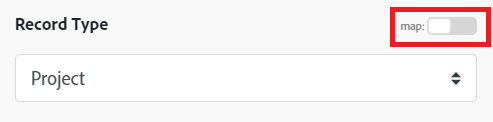

# [!DNL Azure Active Directory] modules

In an Adobe Workfront Fusion scenario, you can automate workflows that use [!DNL Azure Active Directory], as well as connect it to multiple third-party applications and services.

For instructions on creating a scenario, see the articles under [Create scenarios: article index](/help/workfront-fusion/create-scenarios/create-scenarios-toc.md).

For information about modules, see the articles under [Modules: article index](/help/workfront-fusion/references/modules/modules-toc.md).

## Access requirements

+++ Expand to view access requirements for the functionality in this article.

You must have the following access to use the functionality in this article:

<table style="table-layout:auto">
 <col> 
 <col> 
 <tbody> 
  <tr> 
   <td role="rowheader">Adobe Workfront package</td> 
   <td> 
Any
 </td> 
  </tr> 
  <tr data-mc-conditions=""> 
   <td role="rowheader">Adobe Workfront license</td> 
   <td> 
New: Standard

Or

Current:  Work or higher
 </td> 
  </tr> 
  <tr> 
   <td role="rowheader">Adobe Workfront Fusion license**</td> 
   <td>
   
Current: No Workfront Fusion license requirement

   
Or

   
Legacy: Workfront Fusion for Work Automation and Integration 

   </td> 
  </tr> 
  <tr> 
   <td role="rowheader">Product</td> 
   <td>
   
New:
 <ul><li>Select or Prime Workfront package: Your organization must purchase Adobe Workfront Fusion.</li><li>Ultimate Workfront package: Workfront Fusion is included.</li></ul>
   
Or

   
Current: Your organization must purchase Adobe Workfront Fusion.

   </td> 
  </tr>
 </tbody> 
</table>

For more detail about the information in this table, see [Access requirements in documentation](/help/workfront-fusion/references/licenses-and-roles/access-level-requirements-in-documentation.md).

For information on Adobe Workfront Fusion licenses, see [Adobe Workfront Fusion licenses](/help/workfront-fusion/set-up-and-manage-workfront-fusion/licensing-operations-overview/license-automation-vs-integration.md).

+++

## Prerequisites

To use [!DNL Azure Active Directory] modules, you must have an [!DNL Azure Active Directory] account.

## [!DNL Azure Active Directory] API information

The Azure Active Directory connector uses the following:

<table style="table-layout:auto"> 
 <col> 
 <col> 
 <tbody> 
  <tr> 
   <td role="rowheader">API version</td> 
   <td> v1.0 </td> 
  </tr> 
  <tr> 
   <td role="rowheader">API tag</td> 
   <td>v1.4.5</td> 
  </tr>
 </tbody> 
</table>

## [!DNL Azure Active Directory] modules and their fields

When you configure [!DNL Azure Active Directory] modules, Workfront Fusion displays the fields listed below. Along with these, additional [!DNL Azure Active Directory] fields might display, depending on factors such as your access level in the app or service. A bolded title in a module indicates a required field.

If you see the map button above a field or function, you can use it to set variables and functions for that field. For more information, see [Map information from one module to another in Adobe Workfront Fusion](/help/workfront-fusion/create-scenarios/map-data/map-data-from-one-to-another.md).

* [Triggers](#triggers)
* [Actions](#actions)
* [Searches](#searches)

### Triggers 

#### [!UICONTROL Watch records] (scheduled)

This polling (scheduled) trigger module executes a scenario when a record in a selected object has been created since the last scheduled run in [!DNL Azure Active Directory]. It also returns all standard fields associated with the record or records, along with any custom fields and values that the connection accesses.You can map this information in subsequent modules in the scenario.

When you are configuring this module, the following fields display.

<table style="table-layout:auto"> 
 <col> 
 <col> 
 <tbody> 
  <tr> 
   <td role="rowheader">[!UICONTROL Connection]</td> 
   <td> 
For instructions about connecting your [!DNL Azure Active Directory] account to Workfront Fusion, see <a href="/help/workfront-fusion/create-scenarios/connect-to-apps/connect-to-fusion-general.md" class="MCXref xref" data-mc-variable-override="">Create a connection to Adobe Workfront Fusion - Basic instructions</a>.
 </td> 
  </tr> 
  <tr> 
   <td role="rowheader">[!UICONTROL Type]</td> 
   <td>Select whether you want to watch User records or Group records.</td> 
  </tr> 
  <tr> 
   <td role="rowheader">[!UICONTROL Maximum Number of Records]</td> 
   <td>Enter or map the maximum number of records you want the module to return during each scenario execution cycle.</td> 
  </tr> 
 </tbody> 
</table>

### Actions 

* [[!UICONTROL Read Record]](#read-record)
* [[!UICONTROL Create Record]](#create-record)
* [[!UICONTROL Custom API Call]](#custom-api-call)

#### [!UICONTROL Read Record] 

This action module reads data from a single record in [!DNL Azure Active Directory].

You specify the ID of the record.

The module returns the ID of the record and any associated fields, along with any custom fields and values that the connection accesses. You can map this information in subsequent modules in the scenario.

You must have sufficient permissions to access the record in [!DNL Azure Active Directory] in order to retrieve this information.

When you are configuring this module, the following fields display.

<table style="table-layout:auto">
 <col> 
 <col> 
 <tbody> 
  <tr> 
   <td role="rowheader">[!UICONTROL Connection]</td> 
   <td> 
For instructions about connecting your [!DNL Azure Active Directory] account to Workfront Fusion, see <a href="/help/workfront-fusion/create-scenarios/connect-to-apps/connect-to-fusion-general.md" class="MCXref xref" data-mc-variable-override="">Create a connection to Adobe Workfront Fusion - Basic instructions</a>.
 </td> 
  </tr> 
  <tr> 
   <td role="rowheader">[!UICONTROL Record Type]</td> 
   <td>Select whether you want to read a [!UICONTROL User] record or a [!UICONTROL Group] record.</td> 
  </tr> 
  <tr> 
   <td role="rowheader">[!UICONTROL Outputs]</td> 
   <td>Select the information you want included in the output bundle for this module.</td> 
  </tr> 
  <tr> 
   <td role="rowheader">[!UICONTROL ID]</td> 
   <td>Enter or map the unique [!DNL Azure Active Directory] ID of the record that you want the module to read.</td> 
  </tr> 
 </tbody> 
</table>

#### [!UICONTROL Create Record] 

This action module creates a new user or group record.

You specify the type of the record you want.

The module returns the ID of the  record and any associated fields, along with any custom fields and values that the connection accesses. You can map this information in subsequent modules in the scenario.

When you are configuring this module, the following fields display.

<table style="table-layout:auto">
 <col> 
 <col> 
 <tbody> 
  <tr> 
   <td role="rowheader">[!UICONTROL Connection]</td> 
   <td> 
For instructions about connecting your [!DNL Azure Active Directory] account to Workfront Fusion, see <a href="/help/workfront-fusion/create-scenarios/connect-to-apps/connect-to-fusion-general.md" class="MCXref xref" data-mc-variable-override="">Create a connection to Adobe Workfront Fusion - Basic instructions</a>.
 </td> 
  </tr> 
  <tr> 
   <td role="rowheader">[!UICONTROL Record Type]</td> 
   <td>Select whether you want to read a [!UICONTROL User] record or a [!UICONTROL Group] record.</td> 
  </tr> 
  <tr> 
   <td role="rowheader">[!UICONTROL Other Fields]</td> 
   <td>Fill in these fields to set the values for the new record.</td> 
  </tr> 
 </tbody> 
</table>

#### [!UICONTROL Custom API Call] 

This action module lets you make a custom authenticated call to the [!DNL Azure Active Directory] API. This way, you can create a data flow automation that can't be accomplished by the other [!DNL Azure Active Directory] modules.

When you are configuring this module, the following fields display.

<table style="table-layout:auto">
 <col> 
 <col> 
 <tbody> 
  <tr> 
   <td role="rowheader">[!UICONTROL Connection]</td> 
   <td> 
For instructions about connecting your [!DNL Azure Active Directory] account to Workfront Fusion, see <a href="/help/workfront-fusion/create-scenarios/connect-to-apps/connect-to-fusion-general.md" class="MCXref xref" data-mc-variable-override="">Create a connection to Adobe Workfront Fusion - Basic instructions</a>.
 </td> 
  </tr> 
  <tr> 
   <td role="rowheader">[!UICONTROL URL]</td> 
   <td>Enter or map a path relative to <code>https://graph.microsoft.com/{version}/{resource}?{query-parameters}</code></td> 
  </tr> 
  <tr> 
   <td role="rowheader">[!UICONTROL Method]</td> 
   <td> 
Select the HTTP request method you need to configure the API call. For more information, see <a href="/help/workfront-fusion/references/modules/http-request-methods.md" class="MCXref xref" data-mc-variable-override="">HTTP request methods</a>.
 </td> 
  </tr> 
  <tr> 
   <td role="rowheader">[!UICONTROL Headers]</td> 
   <td> 
Add the headers of the request in the form of a standard JSON object.
 
For example, <code>{"Content-type":"application/json"}</code>
 </td> 
  </tr> 
  <tr> 
   <td role="rowheader">[!UICONTROL Query String]</td> 
   <td> 
Add the query for the API call in the form of a standard JSON object.
 
For example: <code>{"name":"something-urgent"}</code>
 </td> 
  </tr> 
  <tr> 
   <td role="rowheader">[!UICONTROL Body]</td> 
   <td> 
Add the body content for the API call in the form of a standard JSON object.
 
Note:  
When using conditional statements such as <code>if</code> in your JSON, put the quotation marks outside of the conditional statement.
 
     
Example: </b>"> 
      
  
 
     
 
 </td> 
  </tr> 
 </tbody> 
</table>

### Searches 

* [Search Users](#search-users)
* [Search Users/Groups Delta](#search-usersgroups-delta)

#### [!UICONTROL Search Users] 

This search module looks for records in an object in [!DNL Azure Active Directory] that match the search query you specify. You can map this information in subsequent modules in the scenario.

When you are configuring this module, the following fields display.

<table style="table-layout:auto">
 <col> 
 <col> 
 <tbody> 
  <tr> 
   <td role="rowheader">[!UICONTROL Connection]</td> 
   <td> 
For instructions about connecting your [!DNL Azure Active Directory] account to Workfront Fusion, see <a href="/help/workfront-fusion/create-scenarios/connect-to-apps/connect-to-fusion-general.md" class="MCXref xref" data-mc-variable-override="">Create a connection to Adobe Workfront Fusion - Basic instructions</a>.
 </td> 
  </tr> 
  <tr data-mc-conditions=""> 
   <td role="rowheader">[!UICONTROL Search Criteria]</td> 
   <td> 
Enter the criteria that you want to use in your search.
 
For information about the parameters to use, such as "[!UICONTROL $filter]", see <a href="https://docs.microsoft.com/en-us/graph/query-parameters">Use query parameters to customize responses</a> in the [!DNL Microsoft] API documentation.
 </td> 
  </tr> 
  <tr data-mc-conditions=""> 
   <td role="rowheader">[!UICONTROL Outputs]</td> 
   <td>Select the information you want included in the output bundle for this module.</td> 
  </tr> 
  <tr data-mc-conditions=""> 
   <td role="rowheader">[!UICONTROL Maximal count of records]</td> 
   <td>Enter or map the maximum number of records you want the module to return during each scenario execution cycle.</td> 
  </tr> 
 </tbody> 
</table>

#### [!UICONTROL Search Users/Groups Delta]  

This search module looks for records in [!DNL Azure AD] that have been created, updated, or deleted. You can map this information in subsequent modules in the scenario.

<table style="table-layout:auto">
 <col> 
 <col> 
 <tbody> 
  <tr> 
   <td role="rowheader">[!UICONTROL Connection]</td> 
   <td> 
For instructions about connecting your [!DNL Azure Active Directory] account to Workfront Fusion, see <a href="/help/workfront-fusion/create-scenarios/connect-to-apps/connect-to-fusion-general.md" class="MCXref xref" data-mc-variable-override="">Create a connection to Adobe Workfront Fusion - Basic instructions</a>.
 </td> 
  </tr> 
  <tr data-mc-conditions=""> 
   <td role="rowheader">[!UICONTROL Limit]</td> 
   <td>Enter or map the maximum number of records you want the module to return during each scenario execution cycle.</td> 
  </tr> 
 </tbody> 
</table>
