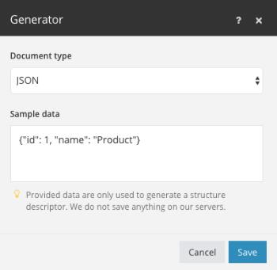

# Data structures

A data structure is a document or pattern that describes in detail the format of the data being processed in [!DNL Adobe Workfront Fusion]. Based on this document, the scenario editor is able to figure out which module returns or receives which kind of data. The data structure documents are most commonly used for serializing/parsing data formats such as JSON, XML, CSV and others.

You can create a data structure by clicking the [!UICONTROL Create a new data structure] button in the [!UICONTROL Data structure overview] section or in the settings of the module that requires data structure specification.

Supported data types are described in the [Data types](/help/workfront-fusion/references/mapping-panel/data-types/item-data-types.md) article.

## Data structure generator

You don't always need to create data structures. Workfront Fusion can generate data structures from existing data. You provide a data sample, and then the generator automatically creates a data structure based on that data sample. You can then manually modify the created data structure if necessary.

To generate a data structure, see [Set up the data structure](/help/workfront-fusion/create-scenarios/map-data/data-stores.md#set-up-the-data-structure) in the article Data stores.

