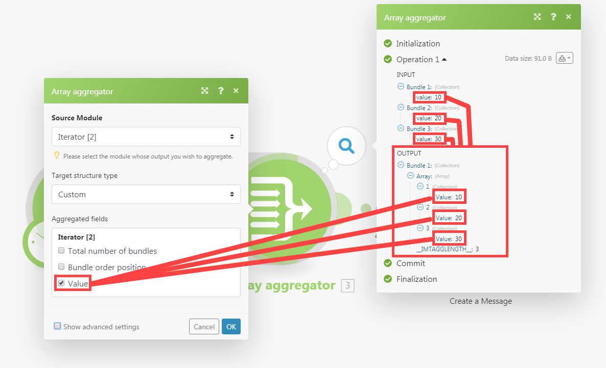
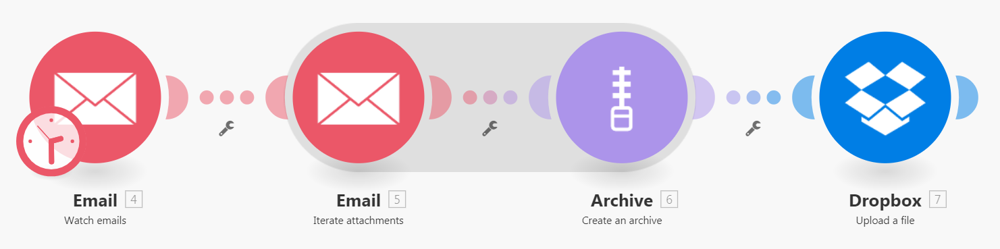

# [!UICONTROL Aggregator] module

<!--audited: 09/2024-->

An aggregator module is a module that merges several bundles of data into a single bundle. 

<!--For more information about module types, see [Types of modules](../../workfront-fusion/modules/module-types.md).-->

## Access requirements

+++ Expand to view access requirements for the functionality in this article.

You must have the following access to use the functionality in this article:

<table style="table-layout:auto">
 <col> 
 <col> 
 <tbody> 
  <tr> 
    <td role="rowheader">[!DNL Adobe Workfront] plan</td> 
   <td> 
Any
 </td> 
  </tr> 
  <tr data-mc-conditions=""> 
   <td role="rowheader">[!DNL Adobe Workfront] license</td> 
   <td> New: Standard
Or

Current: Work or higher
 </td> 
  </tr> 
  <tr> 
   <td role="rowheader">[!UICONTROL Adobe Workfront Fusion] license</td> 
   <td>
   
Current: No [!DNL Workfront Fusion] license requirement.

   
Or

   
Legacy: Any 

   </td> 
  </tr> 
  <tr> 
   <td role="rowheader">Product</td> 
   <td>
   
New:
 <ul><li>[!UICONTROL Select] or [!UICONTROL Prime] [!DNL Workfront] Plan: Your organization must purchase [!DNL Adobe Workfront Fusion].</li><li>[!UICONTROL Ultimate] [!DNL Workfront] Plan: [!DNL Workfront Fusion] is included.</li></ul>
   
Or

   
Current: Your organization must purchase [!DNL Adobe Workfront Fusion].

   </td> 
  </tr>
 </tbody> 
</table>

To find out what plan, license type, or access you have, contact your [!DNL Workfront] administrator.

<!--For information on [!DNL Adobe Workfront Fusion] licenses, see [[!DNL Adobe Workfront Fusion] licenses](../../workfront-fusion/get-started/license-automation-vs-integration.md).-->

+++

## [!UICONTROL Aggregator] module overview

When an [!UICONTROL Aggregator] module executes, it does the following:

* Accumulates all the bundles from a single source module's operation.
* Outputs a single bundle with an array containing one item per accumulated bundle. The content of the array's items depends on the particular [!UICONTROL Aggregator] module and its setup.

The following image shows a typical setup of the [!UICONTROL Aggregator] module :

<table style="table-layout:auto">
 <col> 
 <col> 
 <tbody> 
  <tr> 
   <td> 
[!UICONTROL Source Module]
 </td> 
   <td> 
The module where the bundle aggregation starts. The source module is usually an iterator or a search module that outputs a series of bundles.

When you setup the aggregator's source module (and close the aggregator's setup), the route between the source module and the aggregator module are wrapped in a grey area, so that you can see clearly the start and the end of the aggregation. 
   <!--
 
For more information on iterators, see <a href="../../workfront-fusion/modules/iterator-module.md" class="MCXref xref">[!UICONTROL Iterator] module</a>
 
For more information on search modules see Search modules in <a href="../../workfront-fusion/modules/module-types.md" class="MCXref xref">Types of modules</a>.
--> </td> 
  </tr> 
  <tr> 
   <td> 
[!UICONTROL Target structure type]

(Applicable only for the [!UICONTROL Array aggregator] module.)
 </td> 
   <td> 
 The target structure where the data is aggregated. The default option, [!UICONTROL Custom], enables you to choose items that should be aggregated into the [!UICONTROL Array aggregator]'s output bundle's <code>Array </code>item:
 
  
 
After you connect more modules after the [!UICONTROL Array aggregator] module, and return to the aggregator module's setup, the [!UICONTROL Target] structure type drop-down menu contains all following modules and their fields that are `Array of Collections` type. 
In this example, the [!UICONTROL Attachments] field of the [!DNL Slack] >[!UICONTROL Create a Message] module appears in the Array aggregator > Target structure type field. 
 
  
 </td> 
  </tr> 
  <tr> 
   <td>[!UICONTROL Aggregated fields]</td> 
   <td>The fields that you want to include in the aggregator module output.</td> 
  </tr> 
  <tr> 
   <td> 
[!UICONTROL Group by]
 </td> 
   <td> 
Using the Group by field, you can define an expression containing one or more mapped items. The aggregated data will be then separated into Groups by the value of the expression. Each Group outputs as a separate bundle, containing a Key and an array of data. By grouping results, you can use the Key as a filter in subsequent modules.

   
Each bundle contains two items:
 
    <ul> 
     <li><code>Key</code>: The value that you are grouping by.</li> 
     <li><code>Array</code>: The aggregated data from the bundles for which the formula evaluated to the <code>Key</code> value.</li> 
    </ul> </td> 
  </tr> 
  <tr> 
   <td> 
Stop processing after an empty aggregation
 </td> 
   <td> 
By default, the [!UICONTROL Aggregator] module outputs the result of the aggregation even when no bundles reached the [!UICONTROL Aggregator] module (for example, because they have been all filtered out of the path that includes the aggregator). If the option [!UICONTROL Stop processing after an empty aggregation] is enabled, the [!UICONTROL Aggregator] module does not produce any output bundle when there are no input bundles. Instead, the flow stops.
 </td> 
  </tr> 
 </tbody> 
</table>

>[!NOTE]
>
>Bundles generated by modules between the source module and the [!UICONTROL Aggregator] module are not output by the [!UICONTROL Aggregator] module. These bundles are not accessible by the modules in the flow after the [!UICONTROL Aggregator]. If you need any data from a bundle outputted by a module between the source module and the [!UICONTROL Aggregator] module, make sure to include the given item in the [!UICONTROL Aggregator] module's setup (such as in the [!UICONTROL Aggregated fields] field in the setup of the [!UICONTROL Array aggregator] module).

## Example scenario of how aggregators work

This example scenario shows how to zip all email attachments and uploading the ZIP to [!DNL Dropbox].

The scenario below shows how to:

* The first module watches a mailbox for incoming emails. The [!UICONTROL Email] >[!UICONTROL Watch emails] trigger outputs a bundle with item `Attachments[]`, which is an array containing all the email's attachments.

* The second model iterates the email's attachments: [!UICONTROL Email] >[!UICONTROL Iterate attachments] iterator takes the items from the `Attachments[]` array one by one and sends them further as separate bundles.

* The third module is the aggregator. It aggregates the bundles outputted by the [!UICONTROL Email] >[!UICONTROL Iterate attachments] module. [!UICONTROL Archive] >[!UICONTROL Create an archive aggregator] accumulates all the bundles it receives and outputs a single bundle containing the ZIP file.

* The last module uploads the resulting ZIP file to [!DNL Dropbox].  [!DNL Dropbox] > [!UICONTROL Upload a file] obtains the ZIP file from the [!UICONTROL Archive] > [!UICONTROL Create an archive] module and uploads it to [!DNL Dropbox].

Below is a sample setup of the [!UICONTROL Archive] > [!UICONTROL Create an archive] aggregator:

