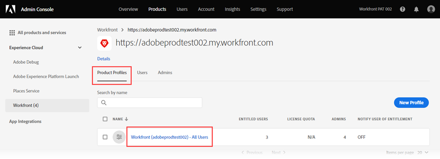

# Add users to Adobe Workfront Fusion through the Adobe Admin Console

>[!IMPORTANT]
>
>The procedures described on this page apply only to organizations that have been onboarded to the [!DNL Adobe Admin Console].
>
>If your organization has not yet been onboarded to the [!DNL Adobe Admin Console], see [Invite a user to an organization](/help/workfront-fusion/set-up-and-manage-workfront-fusion/set-up-and-manage-orgs-and-teams/set-up-orgs-teams-and-users/invite-a-user-to-an-org.md).

You can add a user to the [!DNL Adobe Admin Console] and assign them to [!DNL Adobe Workfront Fusion], or assign an existing user in the [!DNL Adobe Admin Console] to [!DNL Workfront Fusion].

<!--For a video describing [!DNL Workfront Fusion] in the [!DNL Adobe Admin Console], including how to add users, see [[!DNL Fusion] on Adobe IMS](https://video.tv.adobe.com/v/3412464/){target=_blank}.-->

You must have the following access to use the functionality in this article:

<table style="table-layout:auto"> 
 <col> 
 <col> 
 <tbody> 
  <tr> 
   <td role="rowheader">[!DNL Adobe Workfront] plan*</td> 
   <td> 
[!UICONTROL Pro] or higher
 </td> 
  </tr> 
  <tr data-mc-conditions=""> 
   <td role="rowheader">[!DNL Adobe Workfront] license*</td> 
   <td> 
[!UICONTROL Plan], [!UICONTROL Work]
 </td> 
  </tr> 
  <tr> 
   <td role="rowheader">[!DNL Adobe Workfront Fusion] license**</td> 
   <td>
   
Current license requirement: No [!DNL Workfront Fusion] license requirement.

   
Or

   
Legacy license requirement: [!UICONTROL [!DNL Workfront Fusion] for Work Automation and Integration] 

   </td> 
  </tr> 
  <tr> 
   <td role="rowheader">Product</td> 
   <td>
   
Current product requirement: If you have the [!UICONTROL Select] or [!UICONTROL Prime] [!DNL Adobe Workfront] Plan, your organization must purchase [!DNL Adobe Workfront Fusion] as well as [!DNL Adobe Workfront] to use functionality described in this article. [!DNL Workfront Fusion] is included in the [!UICONTROL Ultimate] [!DNL Workfront] plan.

   
Or

   
Legacy product requirement: Your organization must purchase [!DNL Adobe Workfront Fusion] as well as [!DNL Adobe Workfront] to use functionality described in this article.

   </td> 
  </tr>
   <tr> 
   <td role="rowheader">[!DNL Adobe] administrator rights</td> 
   <td>You must be a [!UICONTROL Product Configuration Administrator] of [!DNL Adobe] products for your organization.</td> 
  </tr>
  </tbody> 
</table>

&#42;To find out what plan, license type, or access you have, contact your [!DNL Workfront] administrator.

<!--

&#42;&#42;For information on [!DNL Adobe Workfront Fusion] licenses, see [[!DNL Adobe Workfront Fusion] licenses](../../workfront-fusion/get-started/license-automation-vs-integration.md)

-->

## Access requirements

+++ Expand to view access requirements for the functionality in this article.

You must have the following access to use the functionality in this article:

<table style="table-layout:auto">
 <col> 
 <col> 
 <tbody> 
  <tr> 
   <td role="rowheader">[!DNL Adobe Workfront] plan</td> 
   <td> 
Any
 </td> 
  </tr> 
  <tr data-mc-conditions=""> 
   <td role="rowheader">[!DNL Adobe Workfront] license</td> 
   <td> 
New: [!UICONTROL Standard]

Or

Current: [!UICONTROL Work] or higher
 </td> 
  </tr> 
  <tr> 
   <td role="rowheader">[!DNL Adobe Workfront Fusion] license**</td> 
   <td>
   
Current: No [!DNL Workfront Fusion] license requirement.

   
Or

   
Legacy: Any 

   </td> 
  </tr> 
  <tr> 
   <td role="rowheader">Product</td> 
   <td>
   
New:
 <ul><li>[!UICONTROL Select] or [!UICONTROL Prime] [!DNL Workfront] Plan: Your organization must purchase [!DNL Adobe Workfront Fusion].</li><li>[!UICONTROL Ultimate] [!DNL Workfront] Plan: [!DNL Workfront Fusion] is included.</li></ul>
   
Or

   
Current: Your organization must purchase [!DNL Adobe Workfront Fusion].

   </td> 
  </tr>
  <tr data-mc-conditions=""> 
   <td role="rowheader">Access level configurations*</td> 
   <td> 
     
You must be a [!DNL Workfront Fusion] administrator for your organization.

     
You must be a [!DNL Workfront Fusion] administrator for your team.

   </td> 
  </tr> 
   </td> 
  </tr> 
 </tbody> 
</table>

<!--For more detail about the information in this table, see [Access requirements in Workfront documentation](/help/quicksilver/administration-and-setup/add-users/access-levels-and-object-permissions/access-level-requirements-in-documentation.md).-->

<!--For information on [!DNL Adobe Workfront Fusion] licenses, see [[!DNL Adobe Workfront Fusion] licenses](../../workfront-fusion/get-started/license-automation-vs-integration.md).-->

+++

## Prerequisites

Before using the [!DNL Admin Console] for [!DNL Workfront], you should receive a receive an email inviting you to the console.

1. If you are new to [!DNL Adobe] and you have received an email telling you that you now have administer rights to manage [!DNL Adobe] software and services for your organization, click the button in the email to create an [!DNL Adobe] account and open the [!DNL Admin Console].
    
    Or
    
    If you already have an Adobe account, go to the [[!DNL Adobe Admin Console] page](https://adminconsole.adobe.com).
    

## Add a new user to the [!DNL Adobe Admin Console] and [!DNL Workfront Fusion]

1. From the [[!DNL Adobe Admin Console] page](https://adminconsole.adobe.com/), select the **[!UICONTROL Products]** tab in the top navigation bar, and then select the **[!DNL Workfront Fusion]** product tile.
    
    
    
1. In the list that displays, select the organization where you want to add a user.
    
    
    
1. In the list that displays, with the **[!UICONTROL Product Profiles]** tab selected, click the name of the [!DNL Workfront Fusion] [!UICONTROL Product Profile] link.
    
    <!-- Image refers to WF    -->
     
    >[!IMPORTANT]
    >
    > Do not make any changes to the [!UICONTROL Product Profile] itself.
    
1. With the **[!UICONTROL Users]** tab selected above the list, click **[!UICONTROL Add User]**.
    
1. In the **[!UICONTROL Add users to this product profile]** box, enter the email address or name of a user you want to add, then select the user in the list that appears.

1. Click **[!UICONTROL Save]**.
    
    The user is created in [!DNL Workfront Fusion].
    
1. (Optional) Continue to [Change a user's access level in [!DNL Workfront Fusion]](#change-a-users-access-level-in-workfront-fusion)

## Change a user's access level in Workfront Fusion

* [Change a user's role to Admin](#change-a-users-role-to-admin)
* [Change a user's role to Member, Accountant, or App Developer](#change-a-users-role-to-member-accountant-or-app-developer)

### Change a user's role to Admin

Giving a user an Admin role must be done in the [!DNL Adobe Admin Console]. 

1. On the [!DNL Workfront Fusion] [!UICONTROL Product Profile] page where you added the user, select the **[!UICONTROL Admins]** tab.

1. Click **[!UICONTROL Add Admin]**.

1. In the **[!UICONTROL Add product profile administrators]** box, enter the email address or name of the user you want to become an admin, then select the user in the list that appears.

1. Click **[!UICONTROL Save]**.

   The user is now an Administrator in [!DNL Workfront Fusion].

### Change a user's role to Member, Accountant, or App Developer
    
Member, Accountant, and App Developer roles are handled inside Workfront Fusion. 

For instructions, see [View or edit user roles](/help/workfront-fusion/set-up-and-manage-workfront-fusion/set-up-and-manage-orgs-and-teams/manage-users-and-teams/view-or-edit-user-roles.md).
    
## Assign an existing user in the [!DNL Adobe Admin Console] to [!DNL Workfront Fusion]

You can add an existing user to a team in Fusion. This is handled inside Fusion.

For instructions, see [Add a user to a team](/help/workfront-fusion/set-up-and-manage-workfront-fusion/set-up-and-manage-orgs-and-teams/set-up-orgs-teams-and-users/add-a-user-to-a-team.md).

