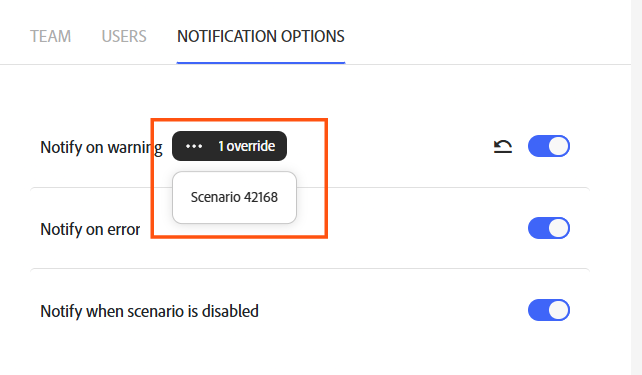

# Set notification options

In your organization uses the Adobe Unified Shell, you receive notifications through the Adobe Notifications area. 

If your organization has not been migrated to the Adobe Unified Shell, you can choose the notifications a team receives. Notifications are set on the team level.

You can control which situations notifications are sent for:

* Notify on warning: Fusion sends a notification when a scenario execution logs a warning.
* Notify on error: Fusion sends a notification when a scenario execution fails.
* Notify when scenario is disabled: Fusion sends a notification when a scenario gets auto-deactivated, such as after too many consecutive errors.

You can set notifications at the team or scenario level. Scenario-level notifications override notifications set at the team level. That is, if a scenario setting directly contradicts a team setting, the scenario setting is followed. The team notification settings display whether there are any overrides for that setting.

By default, all notifications types are enabled in Workfront Fusion.

>[!IMPORTANT]
>
>To receive any notifications from Workfront Fusion, you must have Fusion notifications enabled in your Adobe CX Enterprise notification settings. You can access these settings by clicking the notification bell in the upper-right corner of the screen and clicking the settings icon.

## Access requirements

+++ Expand to view access requirements for the functionality in this article.

<table style="table-layout:auto">
 <col> 
 <col> 
 <tbody> 
  <tr> 
   <td role="rowheader">Adobe Workfront package</td> 
   <td> 
Any Adobe Workfront Workflow package and any Adobe Workfront Automation and Integration package

Workfront Ultimate

Workfront Prime and Select packages, with an additional purchase of Workfront Fusion.
 </td> 
  </tr> 
  <tr data-mc-conditions=""> 
   <td role="rowheader">Adobe Workfront licenses</td> 
   <td> 
Standard

Work or higher
 </td> 
  </tr> 
  <tr> 
   <td role="rowheader">Product</td> 
   <td>
   
If your organization has a Select or Prime Workfront package that does not include Workfront Automation and Integration, your organization must purchase Adobe Workfront Fusion.</li></ul>
   </td> 
  </tr>
  <tr data-mc-conditions=""> 
   <td role="rowheader">Role</td> 
   <td> 
     
You must be a member of the Fusion organization and team that you are adjusting notification settings for.

   </td> 
  </tr> 
 </tbody> 
</table>

For more detail about the information in this table, see [Access requirements in documentation](/help/workfront-fusion/references/licenses-and-roles/access-level-requirements-in-documentation.md).

+++

## View and manage team-level notification settings

1. In Workfront Fusion, click **Team overview** in the left navigation.
1. Click the **Notification options** tab.

   The Notification options list opens. If there are any overrides, the number of overrides appears next to that setting.

1. (Conditional) If there are any overrides, to view which scenarios override the team notification setting, click the three-dot menu for that setting.

   You can click on a scenario in this menu to go directly to that scenario.

   

1. To restore default settings for a notification type, see [Restore notification defaults](#restore-notification-defaults) int his article.

Changes to the Notifications options list are saved automatically.

## Set scenario-level notification settings

Notification setting for individual scenarios are set in that scenario's Scenario settings panel.

1. Click the **[!UICONTROL Scenarios]** tab in the left panel.
1. Select the scenario where you want to add a filter.
1. Click anywhere on the scenario to enter the Scenario editor.
1. Click the [!UICONTROL Scenario settings] icon  at the bottom of your scenario.
1. In the Scenario Settings panel, click **Show advanced settings** at the bottom of the panel.
1. Adjust the **Notify on warning**, **Notify on error**, and **Notify when scenario is disabled** settings as desired.
1. Click **OK** to save and exit the scenario settings.

## Restore notification defaults

You can restore a team notification setting to the defaultfrom the Notification options tab. This sets the notification option to enabled and removes any scenario notification overrides for that notification type.

If the notification type is currently set to the default, the **Restore to default** icon is not visible.

1. In Workfront Fusion, click **Team overview** in the left navigation.
1. Click the **Notification options** tab.

   The Notification options list opens. If a notification type is not currently set to the default, the Restore to default icon is visible for that notification type.

   

1. To restore default settings for that notification type, including any scenario overrides, click the **Reset to default** icon  for that notification type.

Changes to the Notifications options list are saved automatically.

<!--

## Set notification options

If your organization is not on the Adobe Unified Shell, you can set notification settings directly in Fusion.

Email notification options are set on the team level.

1. In the left navigation panel, click **[!UICONTROL Team]**
1. Select the **[!UICONTROL Notification Options]** tab.
1. Enable the notifications that you want the team to receive.

   <table style="table-layout:auto"> 
    <col> 
    <col> 
    <tbody> 
     <tr> 
      <td role="rowheader">'[!UICONTROL Warning in scenario run]'</td> 
      <td> 
Receive an email when there is a warning in a scenario run
 </td> 
     </tr> 
     <tr> 
      <td role="rowheader">[!UICONTROL Errors in scenario run]</td> 
      <td>Receive an email when there is an error in a scenario run.</td> 
     </tr> 
     <tr> 
      <td role="rowheader"> 
[!UICONTROL Scenario deactivation]
 </td> 
      <td>
Receive an email when a scenario deactivates.

In some cases, a scenario might be deactivated by the Workfront Fusion engineering team because the scenario is causing performance or other issues. In these cases, you do not receive notifications in Workfront Fusion. 
</td>

</tr>
</tbody>
</table>

Changes to notification options save automatically.

-->
